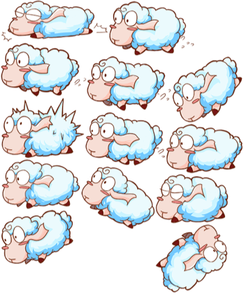
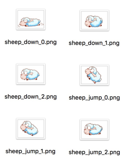

# 아틀라스(Atlas)

아틀라스는 스프라이트 시트(Sprite Sheet)라고도 불리며 게임 개발의 일반적인 에셋입니다. 아틀라스는 도구로 생성됩니다. 이 도구는 많은 이미지를 큰 이미지로 결합하고 인덱스 파일(예 : **plist**)을 만듭니다. 아틀라스 에셋은 **plist** 및 **png**를 포함하며 코코스 크리에이터에 의해 지원됩니다. Atlas 에셋의 이미지는 다음과 같습니다:

## 왜 아틀라스를 사용하나요?(Why using Atlas)

아틀라스의 장점:

- 결합 과정에서 이미지의 여백이 제거됩니다. 그리고 많은 최적화 알고리즘이 사용됩니다. 따라서 게임의 크기와 메모리를 줄일 수 있습니다.
- 하나의 아틀라스 에셋에서 SpriteFrame을 사용하는 많은 스프라이트가 하나의 렌더링 명령으로 렌더링 될 수 있습니다. 이렇게하면 CPU 사용량이 줄어 듭니다.

CodeAndWeb의 비디오를 한번 참조해보세요, [스프라이트시트란 무엇인가?](https://www.codeandweb.com/what-is-a-sprite-sheet)。

## 아틀라스 에셋 만들기(Create Atlas Asset)

아틀라스 생성을 위해 원본 이미지를 준비해야합니다:

그런 다음과 같은 도구를 사용하여 아틀라스를 생성하는것을 추천합니다 :

- [TexturePacker](https://www.codeandweb.com/texturepacker)
- [Zwoptex](https://zwopple.com/zwoptex/)

아틀라스를 내보낼 때 cocos2d-x용 plist 파일을 선택하십시오. 그러면 다음과 같이 **plist** & **png** 같은 이름을 갖게 될 것입니다:

## 아틀라스 가져오기(Import Atlas)

**plist** & **png** 파일을 **Assets Panel**로 동시에 드래그하십시오. 그러면 코코스 크리에이터에서 사용할 수 있습니다.

### Atlas & SpriteFrame

[텍스쳐](sprite.md)에서 Texture & SpriteFrame 사이의 관계를 소개했습니다. 아틀라스 에셋을 가져 오면 여기에 `Atlas` 에셋 옆에 삼각형 아이콘이 있습니다. 그것을 클릭하여 아틀라스 에셋을 확장하십시오. 많은 'SpriteFrame` 하위 자산이 있으며, 각각 개별적으로 사용할 수 있습니다.

## 분리된 이미지들을 아틀라스로 변환하거나 결합된 아틀라스를 분해하는 작업흐름

프로젝트 프로토 타입 단계 또는 초기 제작에서 아트 콘텐츠와 구조 변경이 더 자주 발생합니다. 일반적으로 분리된 이미지를 사용하여 씬을 만들고 UI를 만듭니다. 성능을 최적화하고 패키지를 저장하려면 분리된 이미지를 아틀라스에 병합해야합니다.

현재 우리는 분리된 이미지 또는 이전 아틀라스에서 리다이렉션된 새로운 아틀라스에 이르기까지 그림 리소스 참조에서 씬을 완성하는 간단한 가젯을 제공했습니다. 작업흐름은 아래에 설명되어 있습니다.

1. 새로운 아틀라스 생성 : 분리된 이미지에서 병합하거나 원래의 에피소드를 다시 분할하거나 병합하는 경우에도 TexturePacker를 사용하여 완전한 아틀라스를 생성해야합니다. 그런 다음 새 차트를 프로젝트 리소스 폴더로 가져옵니다.
2. 리소스 참조를 리디렉션해야하는 곳을 두 번 클릭하여 씬 또는 프리팹을 엽니다.
3. 주 메뉴에서 "Developers -> Replace spriteFrame ... with the specified scene in the current scene"를 클릭하고 열리는 대화 상자에서 새로 생성된 아틀라스를 선택한 다음 교체 작업이 완료 될 때까지 기다립니다. (새 앨범이 여러 개인 경우 관련 앨범을 모두 교체 할 때까지 이 단계를 반복해야합니다.)
4. 여러 장면 또는 프리 패브가있는 경우 2-3 단계를 반복하거나 각 관련 장면 또는 프리 패브를 트래버스해야합니다
5. 연관된 이미지 자원에 대한 모든 참조가 새 아틀라스로 대체되었다는 것을 확인한 후, 이제 원래의 깨진 갤러리 또는 오래된 갤러리를 삭제할 수 있습니다.

계속해서 [잘라내기(Trim)](trim.md)에 대해 읽어보세요.
