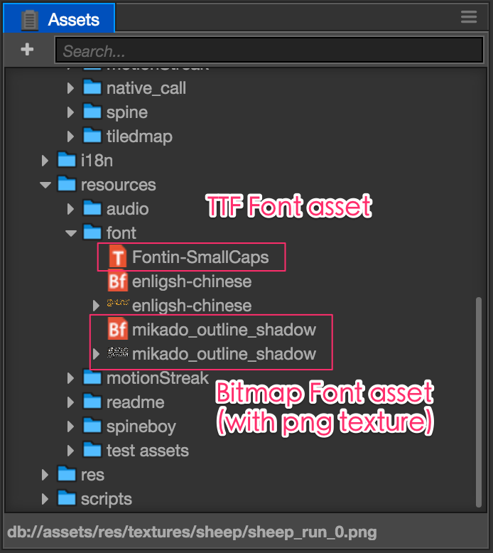
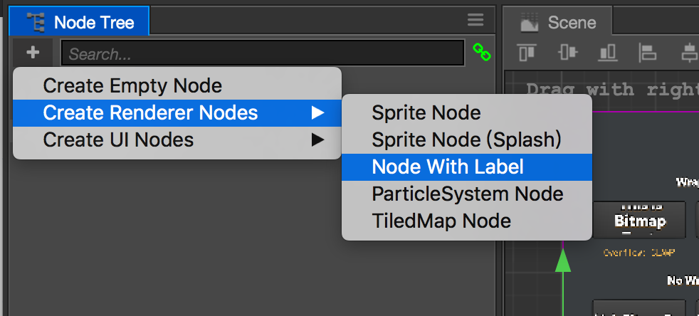
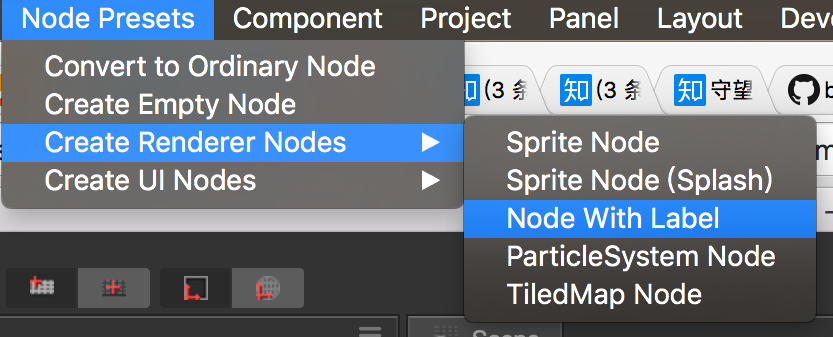
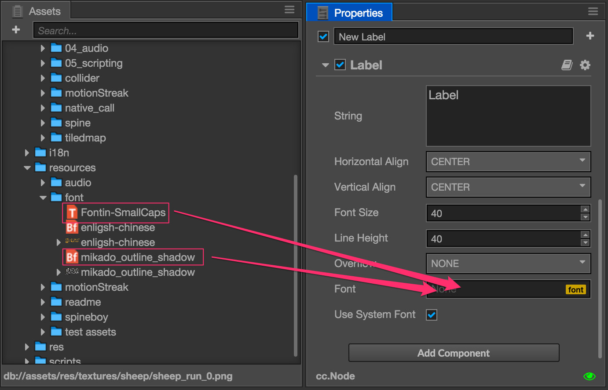

# 글꼴(Font)

코코스 크리에이터에는 시스템 글꼴, 동적 글꼴 및 비트맵 글꼴의 세 가지 유형의 글꼴이 지원됩니다.

시스템 글꼴은 프로젝트에 포함되어 있지 않으며 운영 체제(예 : Windows, Mac, Android, iOS ...)에서 기본 글꼴을 제공하기 위해 게임이 실행되는 플랫폼에만 알려주는 특별한 에셋 유형입니다. 기본적으로 모든 새 레이블은 시스템 글꼴을 사용하므로 [레이블 구성 요소]의 시스템 글꼴 ** 속성 (../ components / label.md)을 선택하여 사용하고 있는지 확인하십시오.

## 글꼴 가져오기(Import Font Asset)

### 동적 글꼴(Dynamic Font)

현재 코코스 크리에이터는 동적 글꼴로 **TTF** 형식 만 지원합니다. 폰트 파일(확장자가 .ttf)을 **Assets** 패널로 드래그하면 폰트 에셋을 가져올 수 있습니다.

### 비트맵 글꼴(Bitmap Font)

비트맵 폰트 자산은`.fnt` 폰트 파일과`.png` 이미지 파일의 두 부분으로 구성됩니다. `.png`는 이미지 맵이고 `.fnt`는 맵의 각 문자에 대한 인덱스입니다. 이 파일 콤보는 특정 도구로 생성할 수 있습니다. [비트맵 글꼴 도구](../getting-started/support.md#--7)를 읽어보십시오.

비트맵 글꼴을 가져올 때 `.fnt`와 `.png` 파일을 **Assets** 패널로 함께 드래그하여 같은 폴더에 넣어야합니다.

가져온 비트 맵 글꼴 애셋은 **Assets**에서 다음과 같이 표시됩니다:

**주의** 에셋 로드를 보다 효율적으로 수행하려면 모든 Bitmap 글꼴에 대해 특정 폴더를 만드는 것이 좋습니다.

## 글꼴 사용하기(Using Font Asset)

글꼴 에셋 필요 **Label** 컴포넌트를 렌더링하려면 다음 방법을 참조하십시오:

### 라벨 노드 만들기(Create Node with Label)

**Node Tree**에서 왼쪽 상단의 '+'(Create Node) 버튼을 클릭하고 'Create Renderer Nodes / Node with Label`을 선택하면 **Label** 노드가 생성됩니다.

또한 메인메뉴에서도 생성하실 수 있습니다: `Node Presets/Create Renderer Nodes/Node with Label`.

### 글꼴 에셋 할당(Assign Font Asset)

메뉴에서 레이블을 만들면 레이블에 기본적으로 시스템 글꼴이 사용됩니다. **Assets** 패널의 글꼴 자산을 **Label** 컴포넌트의 파일 속성 필드로 끌 수 있습니다.

그러면 Label에서 우리가 할당한 글꼴 에셋을 사용하여 렌더링됩니다. 프로젝트 필요에 따라 언제든지 글꼴 에셋을 전환 할 수 있습니다. 프로토 타입 단계에서 시스템 글꼴을 사용하고 UI 인터페이스가 보다 견고 할 때 더 나은 글꼴 에셋으로 대체하는 것이 좋습니다.

글꼴 애셋을 전환 할 때 **Label** 컴포넌트의 다른 속성은 그대로 유지됩니다. `Use System Font' 속성을 체크하여 언제든지 라벨의 시스템 글꼴로 돌아갈 수 있습니다.

### 글꼴 에셋을 드래그하여 라벨 생성(Create Label by Dragging Font Assets)

글꼴 에셋을 만드는 또 다른 방법은 **Asset** 패널의 TTF 또는 비트맵 글꼴 자산을 **Node Tree** 또는 **Scene** 패널로 드래그하는 것입니다. 선택한 글꼴 에셋이 Label 구성 요소의 'File' 속성에 자동으로 지정됩니다.

## 비트맵 글꼴 배쉬 렌더링(Bitmap font bash renderig)

비트맵 글꼴과 다른 Sprite에서 사용하는 텍스처가 동일하고 비트맵 글꼴과 Sprite에 다른 텍스처가 삽입된 렌더링 객체가 없으면 비트맵 글꼴이 렌더링 일괄 처리를 스프라이트와 병합할 수 있습니다. 비트맵 글꼴 리소스를 배치할 때 .fnt 파일, .png 파일 및 스프라이트에서 사용하는 텍스처 파일을 폴더에 넣은 다음 [Auto-atlas Asset](auto- atlas.md)을 참조하여 비트맵 글꼴의 텍스처 및 스프라이트에서 사용되는 글꼴의 아틀라스로 비트맵 글꼴 배쉬 렌더링은 네이티브 및 WebGL 환경에서 자동으로 활성화 될 수 있습니다.

계속해서 [파티클(Particle Asset)](particle.md)에 대해서 읽어보세요.
