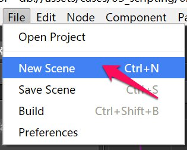
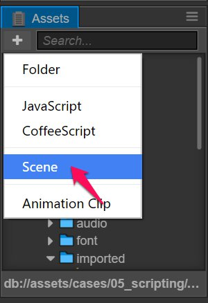
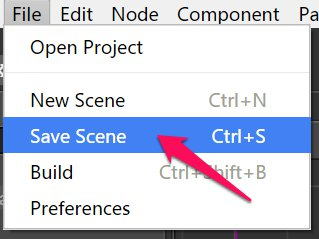

# 씬 생성 및 관리(Creating and managing scenes)

## 씬 생성(Creating a scene)
방법 1: 메인 메뉴에서 __File-->New scene__ 선택.

방법 2: **Assets**의 생성 메뉴를 클릭해서 씬 생성.

## 씬 저장(Saving a scene)
방법 1: 키보드 단축키 __Ctrl + S__ (Windows) 또는 __Command + S__ (Mac).

방법 2: 메인 메뉴에서 __File-->Save scene__ 선택.

## 씬 전환(Switching scenes)
**Assets**에서 전환할 씬을 더블 클릭합니다.

## 이전 씬의 에셋 자동 해제 정책 변경(Change the policy of auto releasing assets from previous scene)

엔진이 다른 씬을 계속 불러오면서 많은 씬이 있는 대규모 게임에서 메모리 사용량은 계속 증가 할 것입니다. `cc.loader.release`와 같은 API를 사용하여 사용하지 않는 에셋을 정확하게 푸는 것 외에도 씬의 자동 해제 기능을 사용할 수 있습니다. 자동 해제를 활성화하려면 **Assets** 패널에서 원하는 씬을 선택한 다음 **Properties** 패널에서 "Auto Release Assets"속성을 변경하십시오. 기본값은 false입니다.  
현재 씬에서 다음 씬으로 전환 할 때 현재 씬이 자동 해제를 비활성화하면 스크립트에서 동적으로 로드되는 것을 제외하고 현재 씬에서 참조하는 모든 에셋(직접 또는 간접적으로)이 **기본적으로** 해제되지 않습니다. 반면 자동 해제를 사용하도록 설정하면 이러한 에셋은 **기본적으로** 해제됩니다.

> 알려진 문제 : 파티클 시스템의 plist에서 참조하는 텍스처가 자동으로 해제되지 않습니다. 입자 텍스처를 자동으로 해제하려면 plist에서 텍스처 정보를 제거하고 입자 구성 요소의 Texture 속성을 사용하여 텍스처를 지정합니다.

### 특정 에셋에 대한 자동 해제 방지(Prevent auto releasing for some specifed assets)

씬에 대해 자동 해제가 활성화 된 상태에서 씬의 에셋 중 일부가 "특수 참조"로 스크립트에 저장되면 리소스가 해제되었기 때문에 씬이 전환되면 이러한 참조가 무효화되며 렌더링 문제가 발생할 수 있습니다. 이러한 에셋이 자동으로 해제되지 않도록하기 위해 `cc.loader.setAutoRelease` 또는 `cc.loader.setAutoReleaseRecursively`를 사용하여 애셋을 유지할 수 있습니다.

> "특수 참조(Special reference)"는 전역 변수, 싱글톤, 클로저, "특수 컴포넌트", "동적 에셋"등의 형태로 참조를 참조합니다. "특수 컴포넌트(special components)"는`cc.game.addPersistRootNode` 메소드에 의해 설정되는 지속 노드 또는 그 자식 노드의 컴포넌트이며, 이들 컴포넌트는 문자열 URL 또는 UUID의 형태로 자산 참조를 포함하거나 배열 및 사전이 아닌 컨테이너 객체. "동적 자산"은 스크립트에서 동적으로 생성되거나 동적으로 수정되는 자산을 의미합니다. 이러한 자산이 장면의 다른 자산을 참조하는 경우에도 동적 자산 자체를 릴리스하지 않아도 다른 자산은 기본적으로 자동으로 릴리스됩니다.

## 씬 로딩 정책 변경(Change the policy of scene loading)

**Assets** 패널에서 씬을 선택하면 **Properties** 패널에 "Async Load Assets"속성이 표시됩니다. 속성은 기본적으로 false입니다.

### 비동기로 에셋 불러오기 해제(Disable Async Load Assets)

씬을로드 할 때 "Async Load Assets"이 false로 설정되면 모든 종속 자산(재귀 자산 포함)이 로드되고 씬이 완전히 로드된 후 실행됩니다.

### 비동기로 에셋 불러오기 켜기(Enable Async Load Assets)

씬을 로드할 때 "Async Load Assets"가 true로 설정되면 씬이 시작된 후에 모든 종속 텍스처, 오디오 및 입자가 지연 로드되어 씬 로딩 속도가 크게 높아집니다.  
그러나 씬이 시작된 후에 플레이어가 하나씩 렌더링 된 일부 에셋을 볼 수 있으며 새 GUI가 화면에 표시되면 GUI의 일부 요소가 나중에 렌더링 될 수 있으므로 이 모드는 웹 게임에 더 좋습니다.  
이 모드에서는 전체 씬을 더 빨리 표시하기 위해 표시되지 않은 렌더링 구성 요소 (예 : Sprite)를 처음부터 비활성화 상태로 유지할 수 있습니다.

> Spine 및 TileMap의 종속 자산은 씬이 시작되기 전에 항상 로드됩니다.

계속해서 [텍스쳐(Textures)](sprite.md)에 대해 읽어보세요.
