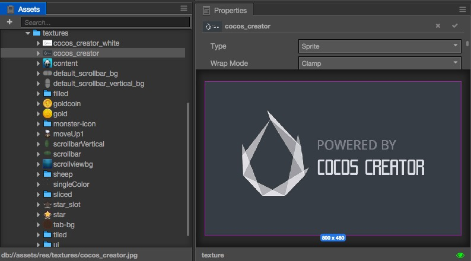

# 텍스쳐(Texture)

텍스처는 게임 렌더링에 사용됩니다. 일반적으로 텍스처는 이미지 처리 소프트웨어 (예 : Photoshop, mspaint)로 만듭니다. 이제 코코스 크리에이터는 두 가지 형식의 이미지를 지원합니다 : ** JPG ** & ** PNG **.

## 텍스쳐 가져오기(Import Textures)

기본적인 방법으로 텍스처를 가져올 수 있습니다. 그런 다음 **Assets Panel**에서 그 텍스처를 볼 수 있습니다:

**Assets Panel**에서 텍스처 아이콘은 썸네일입니다. **Assets Panel**에서 텍스처를 선택하면 **Properties Panel** 하단에 썸네일이 표시됩니다. **정확히 당신이 무엇을 하는지 알지 못한다면** **Properties Panel**에서 텍스처의 속성을 수정하지 마십시오 **.

## 텍스쳐(Texture) & 스프라이트프레임(SpriteFrame)

**Assets Panel**에서 텍스처의 왼쪽에 삼각형이 있습니다. 삼각형을 클릭하면 텍스처의 하위 에셋을 볼 수 있습니다. 코코스 크리에이터는 각 텍스처를 가져올 때 SpriteFrame 에셋을 생성합니다.

스프라이트프레임은 핵심 컴포넌트 **Sprite**에서 사용하는 에셋입니다. **Sprite** 컴포넌트는 'spriteFrame`을 설정/변경하여 다른 이미지를 표시 할 수 있습니다. 자세한 내용은 [Sprite 컴포넌트] (../components/sprite.md)를 참조하십시오.

왜 스프라이트프레임이 추가 되었습니까? 텍스처의 스프라이트프레임 외에도 많은 스프라이트프레임이 포함 된 다른 에셋(Atlas)이 있습니다. 아틀라스에 관해서는 [아틀라스(Atlas)](atlas.md)를 참조할 수 있습니다.

Texture & SpriteFrame 용 API 문서 :

- [Texture](http://www.cocos2d-x.org/docs/api-ref/creator/v1.0/classes/Texture2D.html)
- [SpriteFrame](http://www.cocos2d-x.org/docs/api-ref/creator/v1.0/classes/SpriteFrame.html)

## 스프라이트프레임 사용(SpriteFrame Usage)

**Assets Panel**에서 **Node Tree Panel** 또는 **Scene Panel**로 SpriteFrame 에셋을 드래그하여 **Sprite** 컴포넌트로 노드를 만들 수 있습니다.

그런 다음 SpriteFrame / Texture 에셋을 **Sprite** componet의 'Sprite Frame'속성으로 드래그하여 SpriteFrame을 변경할 수 있습니다.

또한 **Timeline Panel**에 이미 존재하는 SpriteFrame 애니메이션에 SpriteFrame 애셋을 드래그 할 수 있습니다. [스프라이트 애니메이션] (../animation /sprite-animation.md)를 통해 사용법을 참조 할 수 있습니다.

### 성능에 관해서 주의할 점(Performance Attentions)

Sprite에 단일 텍스처 에셋을 사용하는 경우. 게임의 런타임에 배치 렌더링을 사용할 수 없습니다. 이제 코코스 크리에이터에서 SpriteFrame 참조를 단일 텍스처에서 아틀라스로 일괄적으로 변경할 수 없습니다. 따라서 텍스처를 가능한 한 조속히 아틀라스에 결합하십시오.

계속해서 [Atlas] (atlas.md)에 대해 읽어보십시오.
