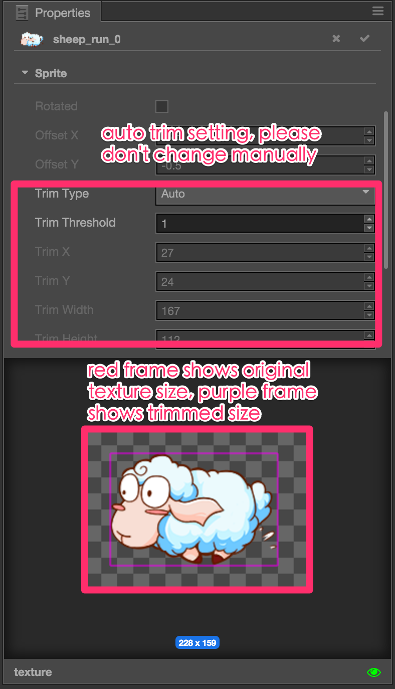
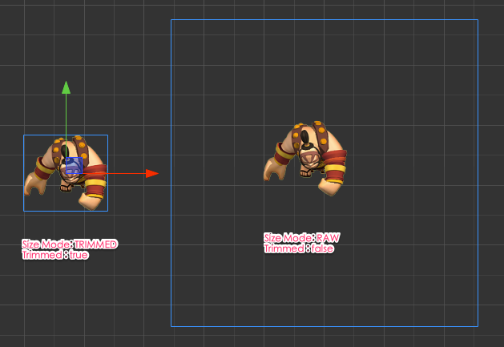
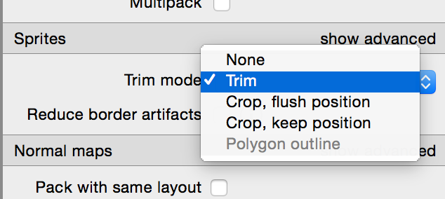

# 스프라이트프레임의 자동 다듬기(Auto Trim for SpriteFrame)

텍스처를 가져 오면 텍스처로 생성된 SpriteFrame 에셋이 이미지 주위의 완전히 투명한 픽셀이 잘리며 자동으로 다듬어집니다. 이것은 스프라이트에 필요한 정확한 노드 크기를 얻는데 도움이 됩니다.

## 스프라이트 컴포넌트의 관련 속성 다듬기(Trim Related Properties in Sprite Component)

**Sprite** 컴포넌트에서 다듬기 설정과 관련된 두 가지 속성이 있습니다:

- `Trim`이 옵션이 선택되면, 노드 경계 상자는 이미지 주위에 투명한 픽셀을 포함하지 않습니다. 대신 테두리 상자는 잘린 이미지에 정확하게 맞습니다. 이 확인란을 선택하지 않으면 투명 상자를 포함한 원래 텍스처가 테두리 상자에 표시됩니다.
- `Size Mode`이 속성의 옵션을 사용하여 노드의 크기를 원래 텍스처 크기 또는 트리밍된 이미지 크기로 설정합니다. 옵션은 다음과 같습니다.
  - 'TRIMMED' 옵션을 선택하면 Sprite 컴포넌트가 사용하는 현재 SpriteFrame의 트리밍 된 이미지 크기를 사용하도록 노드 크기를 설정합니다.
  - `RAW` 옵션을 선택하면 투명한 영역을 포함하여 원본 텍스처 크기를 사용하도록 노드의 크기를 설정합니다.
  - 'CUSTOM' 옵션은 노드의 크기가 SpriteFrame과 함께 변경되지 않도록하고 사용자가 직접 관리해야합니다. 사용자가 **Rect Transform Tool**을 사용하거나 **Properties** 패널의 Size 속성을 사용하여 노드의 크기를 수정하면 Size Mode 속성이 자동으로 'CUSTOM'으로 설정됩니다.

다음 그림은 두 가지 크기 모드의 비교를 보여줍니다:

## 스프라이트 애니메이션의 오프셋(Sprite Animation with offset)

많은 애니메이터가 움직이는 모션을 텍스처로 그리는 것을 선호합니다. 일반적으로 공격 애니메이션에서 볼 수 있습니다. 일반적으로 애니메이터는 큰 캔버스를 사용하고 다른 애니메이션 프레임에 대해 캔버스의 다른 위치에 문자를 배치합니다. 이 경우 모든 애니메이션 프레임은 문자 주위의 크기와 투명 영역이 동일한 텍스처입니다. **Sprite** 컴포넌트의 `Trim` 속성을 `false`로 설정하고 `Size Mode`를 `RAW`로 설정해야합니다. 이 방법으로 스프라이트 애니메이션을 재생할 때 스프라이트 노드 위치가 변경되지 않고 원래의 텍스처에서 오프셋에 따라 문자가 이동합니다.

`Trim` 속성이 `true`로 설정되면 텍스처 오프셋이 없는 애니메이션에 적합합니다.

## 텍스쳐패커 설정(TexturePacker Setting)

스프라이트 애니메이션 텍스처 애셋을 생성하려면 [TexturePacker](https://www.codeandweb.com/texturepacker)와 같은 스프라이트 시트 도구를 사용하는 것이 좋습니다. TexturePacker에서 Sprite 시트를 게시하기 전에 **Trim Mode** 설정에서 Sprite 섹션의 Trim을 선택해야합니다. `Crop, flush position`을 사용하지 마십시오. 트림 정보가 손실되고 원본 텍스처 오프셋을 다시 얻을 수 없습니다.

계속해서 [폰트(Font)](font.md)에 대해 읽어보세요.
