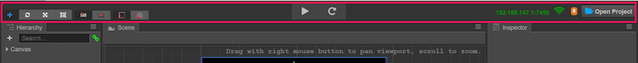

# 에디터 인터페이스 개요
이 장에서는 에디터 인터페이스를 소개하고 에디터를 구성하는 각 패널, 메뉴 및 기능 버튼에 익숙해집니다. 코코스 크리에이터 에디터는 다양한 프로젝트와 개발자의 요구를 충족시키기 위해 자유롭게 이동 및 결합할 수있는 여러 패널로 구성됩니다. 여기서는 기본 에디터 레이아웃을 예로 들어 각 패널의 이름과 기능을 빠르게 탐색합니다.

## 에셋 매니저(Asset manager)

**에셋 매니저**는 프로젝트 에셋 파일에 있는 모든 에셋을 표시합니다 ('assets'). 폴더의 구조로 보여지며 프로젝트 리소스 폴더에 있는 내용이 변경될 때마다 자동으로 동기화합니다. 파일을 드래그하거나 메뉴를 사용하여 리소스를 가져올 수 있습니다.

자세한 내용은 [에셋 매니저](editor-panels/assets.md) 섹션을 참조하십시오.

## 씬 에디터(Scene editor)

**씬 에디터**는 씬의 보이는 작업 영역을 표시하고 편집하는데 사용됩니다. WYSIWYG 씬 작성 작업은 모두 씬 에디터의 표시에 따라 수행됩니다.

자세한 내용은 [씬 에디터](editor-panels/scene.md) 섹션을 참조하십시오.

## 노드 트리(Node Tree)

**노드 트리**는 모든 노드와 그 계층 구조를 목록 트리 형태로 표시합니다. **씬 에디터**에서 볼 수 있는 모든 내용에 대해 해당 노드 항목은 **노드 트리**에서 찾을 수 있습니다. 씬을 편집 할 때 이 두 패널의 내용은 디스플레이를 동기화 할 것이고 일반적으로 이 두 패널을 사용하여 장면을 빌드합니다.

자세한 내용은 [노드 트리](editor-panels/node-tree.md) 섹션을 참조하십시오.

## 속성(Properties)

**속성**는 현재 선택된 노드 및 컴포넌트의 속성을 보고 편집하는 작업 영역입니다. 이 패널은 스크립트에 의해 정의된 컴포넌트 데이터를 가장 적합한 방법으로 표시하고 편집합니다.

자세한 내용은 [속성](editor-panels/properties.md) 섹션을 참조하십시오.

## 툴바(Toolbar)

**툴바**는 씬 편집 도구와 게임 미리보기를 위한 조작 버튼이 포함되어 있습니다. 맨 오른쪽에는 원격 테스트 및 디버깅을 위한 액세스 주소와 연결된 장치의 장치 번호가 표시됩니다.

계속해서 [툴바](toolbar.md)에 대해 읽어보십시오.
