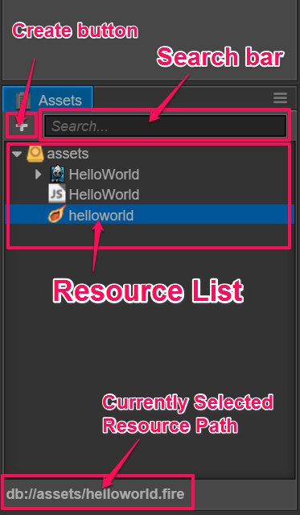
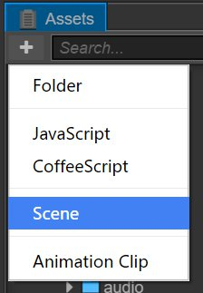

# 에셋

**에셋**은 프로젝트 에셋의 작업 영역에 액세스하고 이를 관리하는 데 사용됩니다. 에셋을 여기에 추가하는 것은 일반적으로 게임을 만들기 시작할 때 필요한 단계입니다. **Hello World** 템플릿을 사용하여 새 프로젝트를 만든 다음 **assets**에 기본 에셋 유형이 있는지 확인할 수 있습니다.

## 인터페이스 소개

**에셋**은 프로젝트 에셋 폴더의 내용을 트리 구조로 표시하지만 프로젝트 폴더의 에셋 카탈로그에 있는 에셋만 여기에 표시됩니다. 프로젝트 폴더 구조에 대한 자세한 내용은 [프로젝트 구조](../../getting-started/project-structure.md)를 참조하십시오. 이제 각 인터페이스의 요소를 소개합니다.

- 왼쪽 상단의 **Create** 버튼은 새 에셋을 만드는 데 사용됩니다.
- 오른쪽 상단의 입력 상자는 특정 텍스트가 포함된 에셋 파일 이름을 검색하고 필터링하는 데 사용할 수 있습니다.
- 패널의 주요 부분은 컨텍스트 메뉴를 사용하거나 드래그하여 에셋을 추가, 삭제 또는 변경할 수있는 에셋 폴더의 에셋 목록입니다.

## 에셋 리스트

에셋 목록에는 모든 폴더 구조가 포함될 수 있습니다. **assets**의 폴더는! [folder](assets/folder.png) 아이콘으로 표시됩니다. 이 아이콘의 왼쪽에 있는 화살표를 클릭하면 폴더의 내용을 펼치고 접을 수 있습니다.

폴더를 제외한 목록의 다른 모든 항목은 에셋 파일입니다. 에셋 목록의 파일에는 확장자가 표시되지 않습니다. 대신 아이콘이 파일 또는 에셋의 유형을 나타내는  사용됩니다. 예를 들어 **HelloWorld** 템플릿으로 만든 프로젝트에는 다음과 같은 3가지 핵심 에셋이 포함됩니다.

- **이미지 에셋** : 현재 'jpg'및 'png'와 같은 이미지 파일이 포함되어 있으면 아이콘이 이미지의 미리보기 이미지로 표시됩니다.
-  **스크립트 에셋** : 프로그래머가 컴파일 한 JavaScript 파일입니다. `js`를 파일 이름 확장자로 사용합니다. 이 스크립트를 편집하여 함수와 게임 로직을 추가합니다.
-  **씬 에셋** : 씬 파일을 열려면 두 번 클릭하십시오. 씬 파일이 열렸을 때만 내용을 계속 만들 수 있습니다.

보다 일반적인 에셋 유형 및 에셋 작업흐름을 보시려면 [에셋 작업흐름] (../../../ asset-workflow/index.md)을 읽어보세요.

### 에셋 만들기

현재 **assets**에서 생성 할 수있는 에셋은 다음과 같습니다:

- 폴더
- 스크립트 파일
- 씬
- 무비클립

왼쪽 상단의 **create** 버튼을 클릭하면 위의 에셋 목록을 포함한 에셋 생성 메뉴가 나타납니다. 항목을 클릭하면 현재 선택한 위치에 새 에셋이 생성됩니다.

### 에셋 선택하기

에셋 목록에서 다음과 같은 에셋 선택을 사용할 수 있습니다.

- 단일 에셋을 선택하려면 클릭하십시오.
- <kbd>Ctrl</kbd> 또는 <kbd>Cmd</kbd>를 누르고 개별 에셋을 클릭하여 함께 선택하십시오.
- <kbd>Shift</kbd>를 누르고 여러 에셋을 선택하려면 클릭하십시오.

선택한 에셋을 이동, 삭제 및 다른 작업에 사용할 수 있습니다.

### 에셋 이동하기

에셋을 선택한 후(여러 에셋을 한꺼번에 선택할 수 있음) 마우스를 누른 상태에서 드래그하여 에셋을 다른 위치로 옮깁니다. 에셋을 폴더로 드래그하면 폴더가 주황색으로 강조되어 이동할 폴더가 표시됩니다.

마우스를 놓아 에셋을 강조 표시된 폴더로 이동하십시오.

### 에셋 삭제하기

에셋을 선택하시고 다음 작업을 통해 삭제하실 수 있습니다:

- 마우스 우클릭 후 팝업 메뉴에서 'delete'를 선택하십시오.
- 에셋을 선택한 후 <kbd>Delete</kbd>(Windows) 또는 <kbd>Cmd + Backspace</kbd>(Mac)를 누르십시오.

애셋 삭제는 돌이킬 수 없는 작업이기 때문에 사용자에게 확인을 요청하는 팝업 대화 상자가 표시됩니다. 사용자가 예를 클릭하면 에셋이 영구적으로 삭제되며 휴지통에서 찾을 수 없습니다! 주의해서 사용하시고 버전 관리 또는 수동 백업을 수행하십시오.

### 기타 명령

**asset**의 우클릭 메뉴는 다음과 같습니다:

- `rename`: 에셋 이름 변경
- `create`: **create** 버튼과 동일한 기능이며, 현재 선택된 폴더에 에셋을 추가합니다. 현재 선택된 파일이 에셋 파일인 경우 새 에셋을 현재 선택된 에셋과 동일한 폴더에 추가합니다.
- `show in Explorer (Windows) or Finder (Mac)`: 운영 체제의 파일 관리자에서 에셋 폴더를 엽니다.
- `Go to the asset location in Library`: 가져온 에셋 위치를 프로젝트 폴더의`Library'에서 엽니다. 자세한 정보는 [프로젝트 구조](../../ project-structure.md)를 참조하십시오.
- `Show UUID`: **console** 창에서 현재 선택한 에셋의 UUID를 표시합니다.
- `Refresh`: 에셋 가져오기 작업을 다시 실행

또한 에셋을 두 번 클릭하면 씬 에셋 및 스크립트 에셋과 같은 특정 에셋 유형에 대한 편집 상태를 입력 할 수 있습니다.

## 에셋 필터링

**assets**의 오른쪽 상단에 있는 검색 상자에 텍스트를 입력하여 입력 텍스트가 포함된 모든 에셋의 파일 이름을 걸러냅니다. `*.png`와 같은 파일 이름 확장자를 입력하여 특정 확장자를 가진 모든 에셋을 나열 할 수도 있습니다.

---

계속해서 [씬 에디터](scene.md)에 대해 알아보세요.
