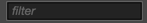
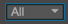

# 콘솔(Console)

**console**은 코코스 크리에이터의 에디터 및 엔진에 의해 생성된 오류, 경고 또는 기타 로그 정보를 보고합니다. 우선 순위에 따라 서로 다른 색상으로 표시됩니다.

- **Log**：회색, 보통 일반적으로 진행 중인 작업을 나타내는데 사용합니다.
- **Info**：파란색, 보통 중요한 표시 정보를 나타내는데 사용합니다.
- **Success**：녹색, 현재 작업이 성공적으로 완료되었음을 나타냅니다.
- **Warn**：노란색, 처리되지 않는 경우 조작에 영향을 줄 수도 있는 비정상적인 상황을 사용자에게 경고합니다.
- **Error**：빨간색, 심한 오류를 나타내며 게임을 실행하기 전에 조치를 취해야합니다.

콘솔에 너무 많은 정보가 있는 경우 콘솔의 위젯을 통해 정보를 효과적으로 필터링할 수 있습니다:

- **Clear**  콘솔 패널의 모든 정보를 지웁니다.
- **Filter input**  입력 텍스트에 따라 콘솔의 정보를 필터링합니다. 옆에 있는`Regex`가 체크되면 입력 텍스트는 텍스트와 일치하는 정규식을 입력하는 용도로 사용됩니다.
- **Information levels**  이 드롭 다운 메뉴에서 하나의 정보 수준을 선택할 수 있습니다. Log 수준에서 Error 수준까지 콘솔은 특정 수준의 정보만 표시합니다. 기본 옵션 `All`은 모든 레벨의 정보를 나타냅니다.
- **Merge same type information**  이 선택 항목이 활성화되면 동일한 정보와 반복 정보가 하나로 병합되며 동일한 유형의 정보가 병합되었음을 알리는 노란색 숫자가 표시됩니다.

---

계속해서 [툴바](../toolbar.md)에 대해 읽어보세요.
