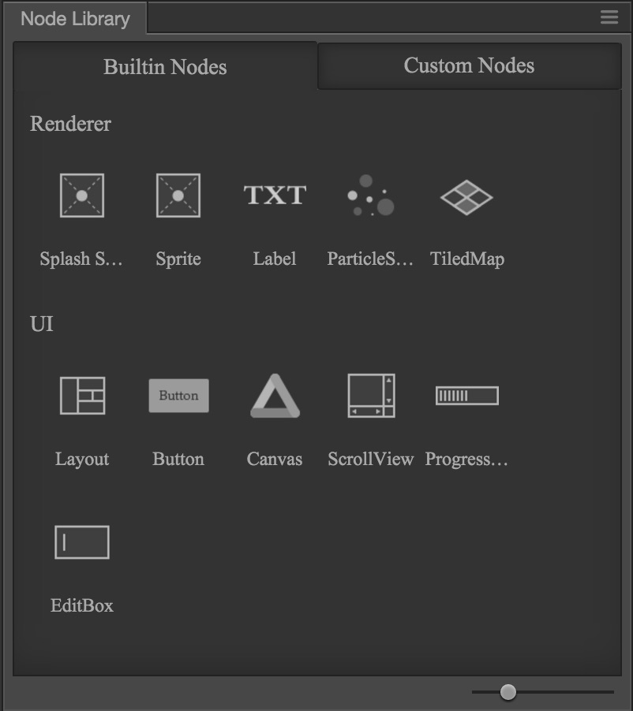
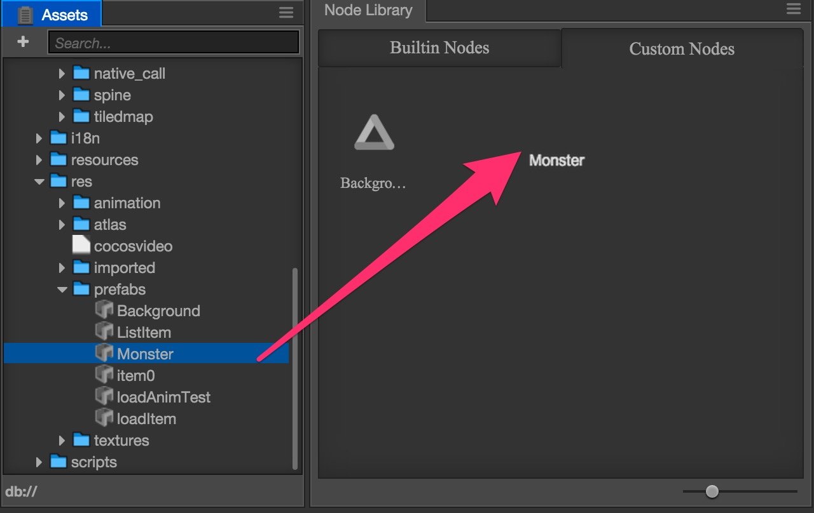

# 노드 라이브러리(Node Library)

**Node Library**는 웨어하우스에 대한 직접적이고 단순한 시각적 제어 수단으로서, 미리 설정된 노드를 **씬(Scene)** 또는 **계층구조(Hierarchy)**로 드래그 앤 드롭하여 프리셋 노드 생성을 신속하게 완료할 수 있습니다.

기본 레이아웃을 사용하면 노드 라이브러리가 에디터에 표시됩니다. 에디터의 레이아웃이 노드 라이브러리에 포함되어 있지 않은 경우, 메인 메뉴의 `Panel-> Node Library`를 통해 노드 라이브러리를 열고 에디터로 드래그 할 수 있습니다.

**Node Library**에는 두 개의 탭으로 표시되는 두 가지 범주가 있습니다.

## 내장 노드(Builtin Nodes)

위의 그림과 같이 에디터에 기본적으로 제공되는 노드들이 모두 나열됩니다.
컨트롤을 씬으로 드래그하면, 빠르게 기본 리소스를 포함하는 스프라이트나 백그라운드맵을 포함하는 버튼, 텍스트 캡션이 포함된 캡션 등을 생성할 수 있습니다.

**Node Library**의 내용은 주 메뉴의 **Nodes**의 내용과 같습니다. 노드 라이브러리를 통해 새 노드를 만드는 것이 더 편리하고 신속합니다.

계속해서 새로운 노드들을 라이브러리에 추가해나갈 것입니다.

## 커스텀 노드(Custom Nodes)

[프리펩(Prefab)](../../../asset-workflow/prefab.md)을 통하여 편리하게 반복적으로 생성할 수 있습니다.

사용자가 이미 제작한 컨트롤을 추가하려면 리소스 관리자에서 해당 조립식 리소스(Prefab)를 커스텀 노드 컨트롤 페이지로 드래그해야합니다.

커스텀 노드 컨트롤에서 요소를 마우스 우클릭하면 컨트롤 라이브러리에서 컨트롤의 이름을 변경하거나 컨트롤을 삭제할 수 있습니다.

그런 다음 씬에 드래그 앤 드롭하는 방식으로 커스텀 노드를 생성할 수 있습니다.
