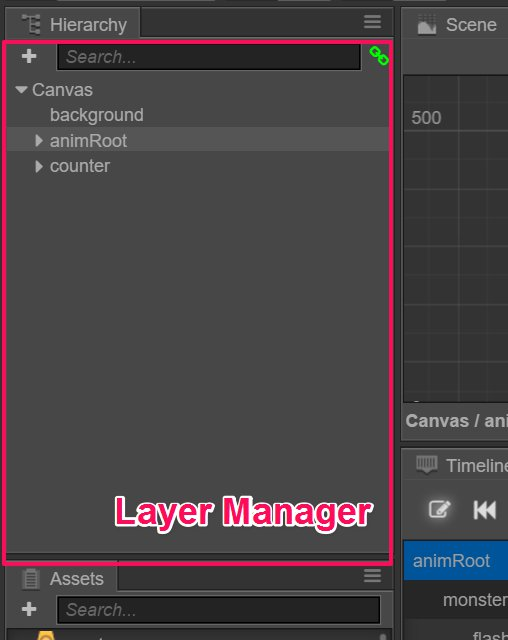
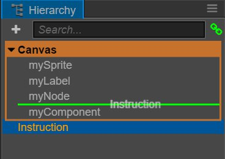

# 노드 트리(Node Tree)

**Node Tree**에는 현재 열려있는 씬의 모든 노드가 포함됩니다. 노드가 보이는 이미지를 포함하든 아니든 관계 없습니다. 여기에서 노드를 선택, 생성 및 삭제하고 한 노드를 다른 노드로 드래그하여 노드의 구성원을 설정할 수 있습니다.

클릭하여 노드를 선택하면 선택한 노드가 파란색으로 강조 표시됩니다. 현재 선택한 노드는 **scene editor**에서 파란색 프레임으로 표시되고 **Properties** 패널에서 내용을 업데이트합니다.

## 노드 생성

노드 트리에서 노드를 만드는 방법에는 두 가지가 있습니다:

- 좌상단의 `+` 버튼을 클릭하거나 마우스 우클릭 후 메뉴에서 **create node** 하위 메뉴를 선택합니다. 그러면 스프라이트(Sprite), 라벨(Label), 버튼(Button) 등 노드 유형을 선택해서 노드를 만들 수 있습니다.
- 이미지, 글꼴 또는 파티클와 같은 에셋을 **탐색기**에서 **Node Tree**로 드래그하십시오. 그러면 선택한 에셋을 사용하여 해당 이미지 렌더링 노드를 만들 수 있습니다.

## 노드 삭제

노드를 선택하고 오른쪽 클릭 메뉴의 'delete' 옵션을 사용하여 선택한 노드를 삭제하거나 <kbd>Delete</kbd> (Windows) 또는 <kbd>Cmd + Backspace</kbd> (Mac) 키를 누릅니다. 선택한 노드에 하위 노드가 있으면 하위 노드도 함께 삭제됩니다.

## 노드의 부모-자식 관계 설정

노드 A를 노드 B로 드래그하면 노드 A가 노드 B의 자식 노드가 됩니다. [탐색기](assets.md)와 마찬가지로 노드 트리는 노드의 계층적 관계도를 표시합니다. 노드 왼쪽에 있는 삼각형 아이콘을 클릭하면 하위 노드 목록을 펼치거나 접을 수 있습니다.

## 노드의 그려지는 순서 변경

한 노드를 다른 노드로 드래그하는 것 외에도 노드를 드래그하여 목록의 노드 순서를 변경할 수 있습니다. 주황색 사각형은 노드가 속한 부모 노드의 범위를 나타내며 녹색 선은 노드가 삽입될 위치를 나타냅니다.

목록의 노드 순서는 장면의 노드 렌더링 순서를 결정합니다. **Node Tree**에 있는 노드가 낮을수록 나중에 렌더링이 장면에서 발생하며 목록의 노드 순위가 높아집니다.

## 기타 명령

노드를 마우스 오른쪽 버튼으로 클릭하면 팝업 메뉴에 다음 작업도 포함됩니다.

- **Copy/paste** : 클립 보드에 노드를 복사한 다음 다른 장소에 붙여 넣거나 다른 씬을 열어 방금 복사한 노드를 붙여 넣습니다.
- **Copy node** : 선택된 노드와 정확히 동일한 노드를 복제 생성합니다.
- **Rename** : 노드 이름 바꾸기
- **Show Path** : 복잡한 씬에서는 스크립트를 실행할 때 노드 트리에 전체 경로를 가져와 액세스해야하는 경우가 있습니다. 이 옵션을 클릭하면 **console**에서 노드의 경로를 볼 수 있습니다.

---

계속해서 [속성(Properties)](properties.md) 패널에 대해서 읽어보세요.
