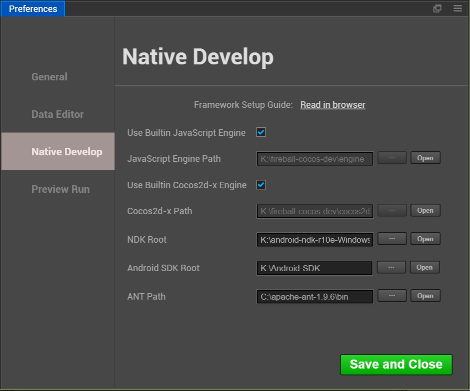
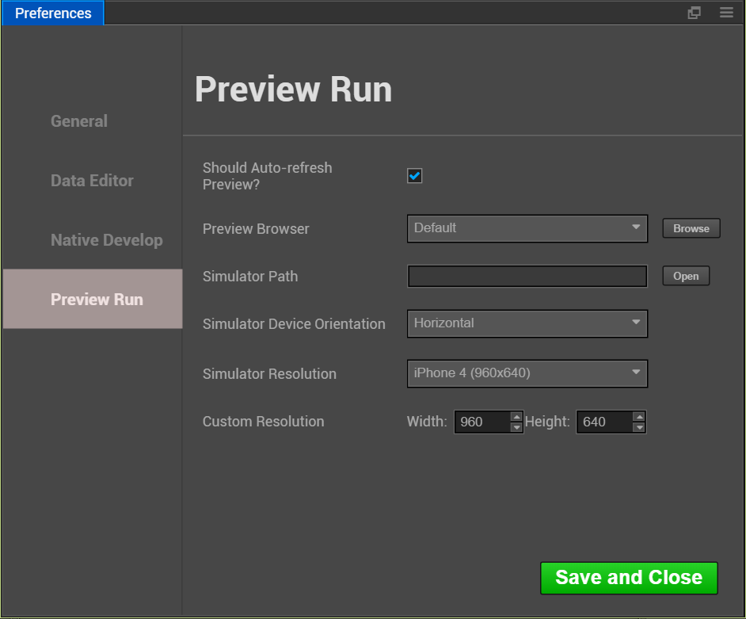

# 설정(Preferences)

**Preferences** 패널에서는 다양한 개인화된 전역 편집기 설정을 제공하며,
**Preferences** 창을 열려면, 메인 메뉴에서 `CocosCreator-> Preferences`를 선택하십시오.

**Preferences**는 여러 페이지로 구성되어 있으며 모든 설정은 다음 범주로 나뉩니다.
**Save and Close** 버튼을 클릭하면 수정된 설정이 적용됩니다.

## General

### Language

`中文`이나 `English`를 선택할 수 있으며, 코코스 크리에이터를 재시작하시면 적용됩니다.

### IP Address

사용자가 이 컴퓨터에 여러 IP 주소를 가질 수 있는 경우,
미리보기용 주소를 주소를 미리 볼 때 수동으로 1 차원 및 2 차원 코드를 기본값으로 선택하십시오.
이렇게 하면 모든 네이티브 IP가 표시되고 **Auto**를 선택하여 에디터가 자동으로 IP를 선택할 수 있도록 할 수 있습니다.

### Displayed Build Console Log

이 항목을 선택하면 원본 프로젝트 게시할 때 **Console** 패널에서 빌드 로그가 직접 표시됩니다.
기본적으로 로그는 `%USER/.CocosCreator/logs/native.log` 프로젝트에 저장됩니다.
패널의 왼쪽 상단 모서리에있는 ** 콘솔 ** 로그 버튼을 사용하여 문서를 열 수 있습니다.
**Cocos Console Log** 옵션 패널의 좌상단에 위치한 **Console** 로그 버튼을 사용하여 문서를 열 수 있습니다.

### Spin step

In the **Properties**, all numeric property has a set of UP and DOWN arrows next to the input box,
values that can be used to step Input:
**Properties**에서 모든 숫자 입력 상자 옆에는 위/아래 화살표가 있으며,
단계별로 값을 조절할 수 있습니다 :

속성 이름의 값 가까이에 커서를 가져 가면 커서가 와 같은 모양으로 바뀌고 마우스를 드래그하면 계속 증가 또는 감소 시킬 수 있습니다.

위의 두 가지 방법으로 값을 수정할 수 있습니다. 기본 조절 크기는 '0.1'입니다.
**Spin step**은 스텝 버튼을 클릭 할 때마다 또는 마우스를 드래그할 때마다 적용됩니다.
예를 들어 주로 스크립트에서 숫자를 정수로 사용하는 경우 단계 크기를 '1'로 설정하면 상황에 따라 더 쉽게 조정할 수 있습니다.

**Note**：에디터 창(Ctrl/Cmd + R)을 새로고침 하신 후에 변경한 내용이 적용됩니다.

## Data Editor

이 범주는 스크립트 및 리소스의 기본 오픈 모드를 설정하는 데 사용됩니다.

### External Script Editor

스크립트 파일을 두 번 클릭하면 **Assets**이 열리는 것처럼 기본으로 제공되는 코드 에디터 또는 외부 에디터를 사용할 수 있습니다.
드롭 다운 메뉴에서 **Internal**를 선택하거나 **Browse** 버튼을 클릭하여 원하는 텍스트 에디터의 실행 파일을 선택하십시오.

### External Picture Editor

위의 옵션과 마찬가지로 **Assets**을 설정할 때 여기에서 그림 파일을 두 번 클릭하고 그림 파일을 열 기본 응용 프로그램 경로를 입력합니다.

## Native Develop

이 분류는 기본 개발 플랫폼(iOS, Android, Mac, Windows) 빌드가 릴리스되는데 필요한 개발 환경 경로를 설정하는 데 사용됩니다.

### Use Builtin JavaScript Engine

코코스 엔진을 내장 엔진 경로로 사용할지 여부는 JavaScript 엔진의 경로로 결정합니다.
이 엔진은 장면을 렌더링하기 위해 **Scene**에 사용되며,
선언 및 기타 내장 컴포넌트 엔진 모듈을 웹 환경에서 사용할 수 있습니다.

### JavaScript Engine Path

`engine`을 사용하는 것 외에도 https://github.com/cocos-creator/engine에서 로컬로 클론 또는 복제해서 커스터마이징하실 수도 있습니다.
**Use Builtin JavaScript Engine**을 선택 해제하고 **Use Builtin JavaScript Engine** 경로를 커스터마이징 엔진의 경로로 설정하세요.

### Use Builtin Cocos2d-x Engine

코코스 크리에이터의 cocos2d-x 내장 엔진을 사용할지 여부는 cocos2d-x c++ 엔진에 설정된 'cocos2d-x'경로로 결정합니다.
이 엔진은 모든 **Build** 네이티브 플랫폼(iOS, Android, Mac, Windows) 프로젝트에서 빛드 및 컴파일하는데 사용합니다.

### Cocos2d-x Path

**Use Builtin Cocos2d-x Engine**은 이전 선택을 취소하고, 수동으로 cocos2d-x의 경로를 지정할 수 있습니다.
참고 여기에 사용된 cocos2d-x 엔진은 https://github.com/cocos-creator/cocos2d-x-lite 또는 웨어하우스 포크에서 다운로드할 수 있습니다.

### NDK Path

NDK 경로 설정은 [네이티브 개발 환경 설정](../../../publish/setup-native-development.md)을 참조하세요.

### Android SDK Path

Android SDK 경로 설정은 [네이티브 개발 환경 설정](../../../publish/setup-native-development.md)을 참조하세요.

### ANT Path

ANT 경로 설정은 [네이티브 개발 환경 설정](../../../publish/setup-native-development.md)을 참조하세요.

## Preview Run

메인 창 바로 위에 **Play** 버튼을 사용할 때 다양한 옵션을 설정할 수 있습니다.

### Should Auto-refresh Preview

브라우저나 시뮬레이터에서 씬을 실행할 때 씬을 저장하거나 스크립트를 다시 컴파일하면 미리보기 디바이스를 자동으로 새로고침하는지 여부를 결정합니다.

### Preview Browser

드롭 다운 메뉴에서 시스템 기본 브라우저를 선택하거나 **Browse** 버튼을 클릭하여 원하시는 브라우저의 경로를 수동으로 지정하십시오.

### Simulator Path

버전 v1.1.0부터 코코스 엔진에 사용되는 코코스 시뮬레이터는 cocos2d-x 엔진의 경로에 배치됩니다.
커스터마이징 엔진을 사용하시는 경우 경로에 위치한 자체 시뮬레이터를 컴파일해야합니다.
**Open** 버튼을 클릭하면 시뮬레이터의 파일 시스템 경로에 현재 지정된 파일을 열 수 있습니다.
편리한 디버깅 포지셔닝을 재공합니다.

### Simulator Device Orientation

시뮬레이터가 실행될 때 가로/세로 중 어떤 방식으로 실행할지 설정합니다.

### Simulator Resolution

시뮬레이터의 해상도를 선택하십시오.

### Custom Resolution

기본 해상도가 요구 사항을 충족시키지 못하면,
시뮬레이터 해상도를 설정하기 위해 화면의 높이와 너비를 수동으로 입력 하실 수도 있습니다.
