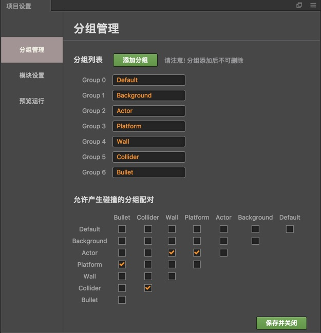
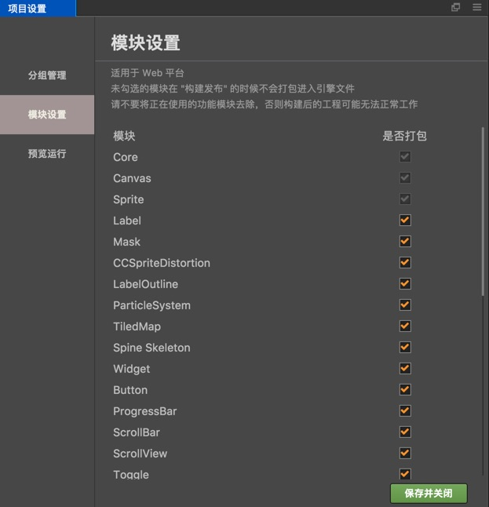
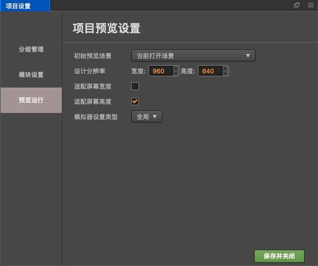

# 프로젝트 설정(Project Settings)

**Project Settings** 패널은 메인 메뉴의 `Project->Project Settings...`를 통하여 접근할 수 있습니다. 이 설정 패널은 프로젝트별로 사용자가 맞춤 관리할 때 사용하는 커스터마이징용 패널입니다. 이 모든 설정은 `settings/project.json`에 저장됩니다. 컴퓨터간에 프로젝트 설정을 동기화해야하는 경우 버전 관리에 `settings` 폴더를 포함하십시오.

## Group Manager

**Project Settings**의 **Group Manager** 탭은 주로 충돌 그룹 지원을 제공하기 위해 [충돌 시스템](../../../ physics/index.md)에서 사용합니다. [충돌 그룹](../../../ physics/collision/collision-group.md)을 참조하십시오.

## Module Config

이 설정은 이 페이지에서 확인한 모듈만 포함하여 웹 플랫폼 릴리스용 게임 엔진을 작성하며 선택하지 않으신 모듈이 제외됩니다.

여기서 사용하지 않는 모듈을 제외하면 엔진 패키지의 크기가 크게 줄어듭니다. 스크립트에서 제외한 모듈을 사용하지 않기 위해서 빌드 후 패키지를 완전히 테스트하는 것이 좋습니다.

## Preview Run

**Preview Run**에서는 초기 미리보기 장면, 해상도 등을 설정하는 데 사용되는 [환경 설정 패널](preferences.md)의 **Preview Run** 페이지와 비슷한 옵션을 제공하지만 현재 계획 중입니다.

### Preview Start Scene

이 옵션은 에디터 상단의 **Preview** 버튼을 누를 때 실행할 씬을 설정합니다. **Current Opened Scene**으로 설정하면 현재 편집중인 씬이 실행됩니다. 또한이 옵션을 씬 목록의 특정 씬(로그인 씬에서 항상 시작해야하는 프로젝트의 경우)으로 설정할 수도 있습니다.

### Design resolution, Fit Width / Fit Height

이 설정을 사용하여 캔버스 노드의 기본 디자인 해상도 값을 지정하고 새 씬을 만들 때 **Fit Height** 및 **Fit Width** 옵션을 선택하거나 **Canvas Component**를 지정합니다.

### Simulator Setting Type

이 설정을 사용하여 시뮬레이터 미리보기 해상도 및 화면 방향을 설정합니다. 이 옵션을 **Global**로 설정하면 **Preferences**의 시뮬레이터 해상도와 화면 방향 설정이 사용됩니다. **Project**로 설정하면 다음 시뮬레이터 설정이 표시됩니다.

- 시뮬레이터 디바이스 방향(Simulator Device Orientation)
- 시뮬레이터 해상도(Simulator Resolution)
- 시뮬레이터 커스텀 해상도(Simulator Custom Resolution)

위의 옵션은 [환경 설정](preferences.md) 패널의 옵션과 동일합니다.
