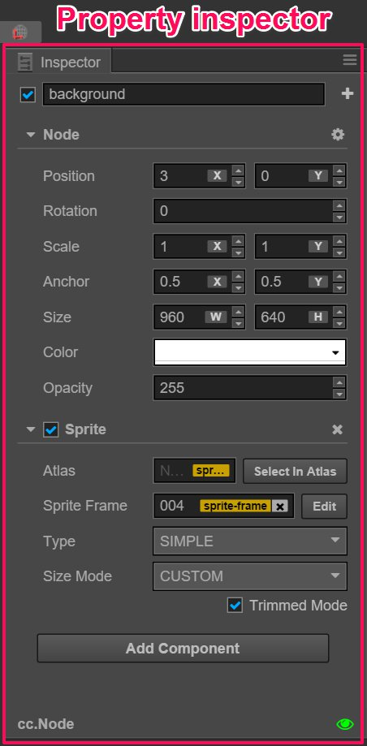
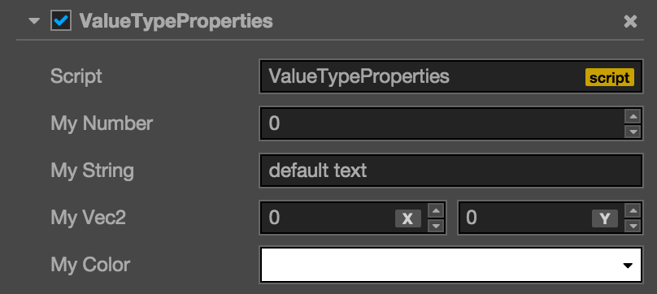

# 속성(Properties)

**Properties** 패널은 현재 선택된 노드 및 컴포넌트 속성을 확인하고 편집하는 작업 영역입니다. **Scene editor** 또는 **Node Tree**에서 노드를 선택하면 이 노드의 속성과이 노드의 모든 컴포넌트의 속성이 조회 및 편집을 위해 **Properties** 패널에 표시됩니다.

**Properties** 패널이 위에서 아래로 표시됩니다:

- 노드 활성화 스위치 및 노드 이름(node name and activating switch)
- 노드 속성(Node Properties)
- 컴포넌트 속성(Component attribute)

## node name and activating switch

왼쪽 상단 모서리의 체크박스는 노드의 활성화 상태를 나타냅니다. 사용된 노드가 활성화되지 않으면 노드의 이미지 렌더링과 관련된 모든 컴포넌트가 종료됩니다. 하위 노드를 포함한 전체 노드는 효율적으로 숨겨집니다.

노드 활성화 스위치의 오른쪽에 표시되는 것은 **Node Tree**에 표시된 노드 이름과 일치하는 노드 이름입니다.

## Node Properties

다음으로, **Properties** 패널은 노드의 속성을 보여주며, 이는 헤드라인 `Node` 아래에 나열됩니다. `Node`를 클릭하면 노드의 속성을 접거나 펼칠 수 있습니다.

위치(Position), 회전(Rotation), 크기(Scale)와 같은 변형 속성 외에도 노드 속성에는 앵커, 색상, 불투명도가 포함됩니다. 일반적으로 노드 속성 수정은 씬 에디터에서 노드의 모양 또는 위치의 변경 사항에 즉시 반영됩니다.

노드 속성에 대한 자세한 내용은 [변형(Transform)](../../../content-workflow/transform.md) 섹션을 참조하십시오.

## Component attribute

노드에 마운트된 모든 컴포넌트와 속성은 노드 속성 아래에 나열됩니다. 노드 속성과 마찬가지로 컴포넌트 속성의 이름을 클릭하여 접힘/펼침 상태를 전환할 수 있습니다. 노드에 많은 컴포넌트가 마운트된 경우 자주 수정되지 않는 컴포넌트 속성을 접어서 더 큰 작업 영역을 확보 할 수 있습니다.

사용자는 스크립트로 컴포넌트를 만들고 그 속성은 스크립트에 의해 선언됩니다. 다른 속성 유형은 **Properties** 패널에서 다른 위젯 모양과 다른 편집법을 가집니다. 속성의 정의 방법은 [스크립팅 속성](../../../scripting/reference/attribute.md)에 자세히 소개되어 있습니다.

## Edit an attribute

**Attribute**은 컴포넌트 스크립트에서 선언된 공용 변수이며 일련 번호를 지정하여 씬 및 애니메이션 데이터에 저장할 수 있습니다. **Properties** 패널을 사용하여 속성 설정을 빠르게 수정하여 게임 데이터를 조정하고 외부 프로그래밍없이 메소드를 재생한다는 목표를 실현할 수 있습니다.

일반적으로 우리는 변수가 사용하는 다른 메모리 위치에 따라 **value type** 및 **reference type**으로 속성을 나눌 수 있습니다.

### Value type attribute

**value type**는 작은 메모리 공간을 차지하는 숫자, 문자열, 열거 형 및 기타 간단한 변수 유형이 포함됩니다:

- Number: 키보드로 직접 입력 할 수 있습니다. 사용자는 입력 필드 옆에있는 위 / 아래 화살표를 눌러 값을 점차적으로 높이거나 낮출 수도 있습니다.
- Vec2: Vec2의 위젯은 두 입력 값의 조합입니다. 입력 필드는 각 값의 해당 하위 속성 이름을 `x` 및 `y`로 표시합니다.
- String: 키보드를 사용하여 문자열을 텍스트 상자에 입력하십시오. 문자열의 입력 위젯은 단일 행과 다중 행의 두 가지 유형으로 나눌 수 있습니다. 사용자는 입력 버튼을 눌러 여러 줄 텍스트 상자로 묶을 수 있습니다.
- Boolean: 체크박스 형식으로 편집 할 수 있습니다. 선택된 상태는 속성 값이 'true'임을 나타냅니다. 비 선택된 상태는 속성 값이 'false'임을 나타낸다.
- Enum: 드롭 다운 메뉴 형식으로 편집 할 수 있습니다. 열거 메뉴를 클릭하고 팝업 메뉴 목록에서 하나의 옵션을 선택하면 열거의 수정을 마칠 수 있습니다.
- Color: Color 속성을 클릭하면 미리보기 상자 및 **color picker** 창이 뜹니다. 이 창에서 필요한 색상을 클릭하여 선택하거나 아래의 RGBA 색상 입력란에 지정된 색상을 직접 입력 할 수 있습니다. **color picker** 창 밖의 아무 위치나 클릭하면 창이 닫히고 마지막에 선택한 색상이 속성 색상으로 사용됩니다.

### Reference type attribute

**Reference type**에는 노드, 컴포넌트 또는 에셋과 같이 훨씬 복잡한 객체가 포함됩니다. 값 유형의 다양한 편집 메소드와 달리 참조 유형에는 일반적으로 노드 또는 에셋을 속성 열로 드래그하는 편집 메소드가 하나만 있습니다.

참조 유형의 속성은 초기화 후에 'None'으로 표시됩니다. 사용자는 스크립트를 사용하여 참조 유형의 속성에 대한 초기화 값을 설정할 수 없기 때문에 속성 유형에 따라 해당 노드 또는 에셋을 드래그하여 참조 유형에 대한 할당을 완료 할 수 있습니다.

노드를 드래그하여 값을 지정해야하는 속성 열에는 녹색 레이블이 표시됩니다. 라벨에 `Node`가 표시될 수 있습니다. 즉, 노드를 드래그 할 수 있습니다. 또한 레이블에는 `Sprite`, `Animation` 등과 같은 컴포넌트 이름이 표시될 수 있습니다. 그런 다음 사용자는 해당 컴포넌트가 마운트된 노드를 드래그해야합니다.

애셋을 드래그하여 값을 할당해야하는 속성 열에는 노란색 라벨이 표시됩니다. `sprite-frame`,`prefab`,`font` 등 레이블에 에셋 유형을 표시 할 수 있습니다. **Assets**에서 해당 유형의 에셋을 끌면 할당을 완료할 수 있습니다

  참고 : 해당 스크립트 파일 또한 에셋 유형입니다. 따라서 위 그림의 맨 위에 표시된 컴포넌트에서 사용하는 스크립트 에셋 참조 속성도 노란색 레이블로 표시됩니다.

---

계속해서 [콘솔(Console)](console.md)에 대해서 읽어보세요.
