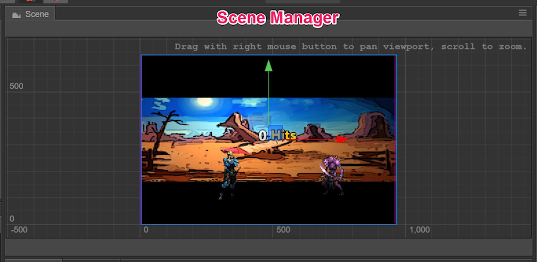
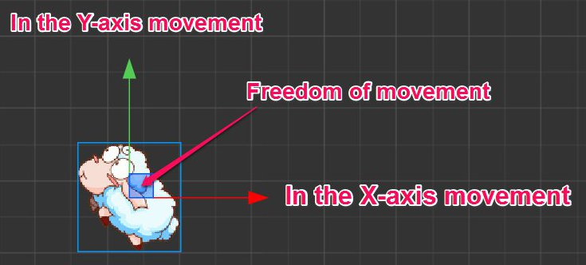
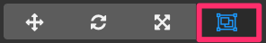

# 씬 에디터(Scene editor)

**Scene editor**는 콘텐츠 제작의 핵심 작업 영역입니다. 장면 이미지, 캐릭터, 특수 효과, UI 및 기타 게임 요소를 선택하여 배치 할 때 이 도구를 사용합니다. 이 작업 영역에서 **transform tool**을 사용하여 위치, 회전, 크기 및 크기와 같은 노드의 속성을 변경할 수 있습니다. WYSIWYG으로 씬에 보이는 효과를 미리 확인할 수도 있습니다.

## 뷰 소개(View Introduction)

### 네비게이션(Navigation)

다음 작업을 통해 **scene editor**에서 뷰를 이동하고 찾을 수 있습니다.

- <kbd>마우스 우클릭 드래그</kbd> : 수평으로 뷰 제거
- <kbd>마우스 휠</kbd> : 현재 마우스가 가리키는 위치를 중심으로 뷰를 확대 / 축소합니다.

### 좌표 시스템(Coordinate system)과 그리드(Grid)

씬 뷰의 배경에는 **world coordinate system**에서 각 점의 위치 정보를 나타내는 스케일플레이트와 그리드가 있습니다. `(0,0)`은 씬 좌표계의 원점입니다. 마우스 휠을 사용하여 뷰 디스플레이를 축소하실 때 각 축척은 '100'픽셀의 거리를 나타냅니다. 현재보기의 확대/축소 비율 차이로 인해 이 지점에서 원점까지의 거리를 나타내는 숫자는 픽셀 단위의 다른 눈금으로 표시됩니다.

눈금은 씬 요소를 배치하는 중요한 참조 정보입니다. 좌표계와 위치와 같은 노드 속성 간의 관계에 대한 정보는 [Transform] (../../../content-workflow/transform.md) 섹션을 참조하십시오.

### 디자인 해상도의 기준 프레임(Indicator Frame of Design resolution)

뷰의 보라색 프레임은 기본적으로 씬에 표시되는 내용 영역을 나타냅니다. 이 영역의 크기는 **design resolution**에 의해 결정됩니다. 디자인 해상도의 설정과 효과는 [Canvas](../../../components/canvas.md) 섹션을 참조하십시오.

## 노드 선택(Select a node)

씬의 노드 위로 마우스 커서를 가져가면 노드의 조건 프레임에 회색 단일선이 표시됩니다. 좌클릭하면 노드가 선택됩니다. 변형 도구(예 : 위치, 회전)를 사용하여 노드 작업을 선택할 수 있습니다.

선택한 노드 주변에 파란색으로 와이어 프레임이 표시되어 노드에 대한 조건 프레임을 나타냅니다.

### 노드 이름 표시(Node name prompt)

노드에 마우스를 가져가면 노드 프레임과 함께 노드 이름이 표시됩니다.

노드 이름에 대해서는 [Node Tree](node-tree.md)의 소개를 읽어보십시오.

### 노드 제약 조건 상자(The node constraint box)

마우스를 가져가거나 노드를 선택할 때 제약 상자(회색 또는 파란색)를 볼 수 있으며 제약 상자의 사각형 영역은 노드의 **size** 속성 크기를 나타냅니다. 노드에 이미지 렌더링 구성 요소(예 : **Sprite**)가 없더라도 노드의 `size` 속성을 설정할 수 있으며 노드의 제약 상자 내의 투명 영역은 마우스를 클릭하거나 마우스를 올리면 선택할 수 있습니다 .

노드의 `size` 속성은 다중 해상도 적응과 레이아웃 전략에서 중요한 역할을 합니다. 자세한 내용은 [다중 해상도 조정 및 요소 정렬](../../../ui/multi-resolution.md)을 참조하십시오.

### 노드 다중선택(Multiselect nodes)

왼쪽 마우스 버튼을 누르고 **scene editor**에서 드래그하면 파란색 선택 영역을 그릴 수 있습니다. 마우스를 놓을 때 선택 영역과 겹치는 노드가 모두 선택됩니다. 마우스를 놓기 전에 선택 영역을 변경하기 위해 원하는대로 마우스를 슬라이드 할 수 있습니다.

여러 노드를 선택하면 모든 변환 작업이 선택된 모든 노드에 영향을 미칩니다.

## 변형 도구를 사용하여 노드 정렬(Use transform tool to arrange node)

**scene editor**의 핵심 기능은 WYSIWYG 방식으로 씬의 보이는 요소를 편집하고 정렬하는 것입니다. 메인 윈도우 도구 모음의 왼쪽 상단 구석에 있는 **transform tool**를 사용하여 노드를 정렬할 수 있습니다.

### 이동 변형 도구(Move transform tool)

**Move transform tool**는 에디터를 열 때 기본적으로 활성화되어있는 변형 도구입니다. 이 도구는 메인 윈도우 도구 모음의 왼쪽 상단에있는 첫 번째 단추를 클릭하여 활성화 할 수 있습니다.

임의의 노드를 선택하면 노드의 중심(또는 앵커의 위치)이 빨강 및 녹색 화살표와 파란색 큐브로 구성된 기즈모로 나타납니다.

**Gizmo**는 마우스와 상호 작용할 수있는 컨트롤러를 말하며 씬 에디터의 특정 편집 상태에서 나타납니다. 이러한 컨트롤러는 게임이 실행되는 동안 게임에 표시되지 않고 편집을 돕기 위해서만 존재합니다.

이동 변형 도구가 활성화되면 :

- 빨간색 화살표를 누르고 마우스를 드래그하면 노드가 x축으로 이동합니다.
- 녹색 화살표를 누르고 마우스를 드래그하면 노드가 y축으로 이동합니다.
- 파란색 큐브를 누르고 마우스를 드래그하면 노드가 두 축 모두에서 자유롭게 이동합니다.

씬 에디터가 활성화되면 키보드 단축키 <kbd>W</kbd>를 누르면 언제든지 변환 도구를 전환 할 수 있습니다.

### 회전 변형 도구(Rotate transform tool)

메인 윈도우의 왼쪽 상단 모서리에 위치한 툴바에서 두번째 버튼을 클릭하거나 씬 에디터에서 키보드 단축키 <kbd>E</kbd>를 누르면 **rotate transform tool**가 활성화됩니다.

회전 변형 도구의 기즈모는 주로 화살표와 원으로 구성됩니다. 화살촉의 방향은 현재 노드의 `회전(rotation)` 각도를 나타냅니다. 화살표 또는 원의 임의의 점을 드래그하여 노드를 회전시킬 수 있으며 마우스를 놓기 전에 기즈모에서 현재 회전의 각도 값을 가져올 수 있습니다.

### 크기 변형 도구(Scale transform tool)

메인 윈도우의 왼쪽 상단 모서리에있는 툴바에서 세 번째 버튼을 클릭하거나 씬 에디터에서 키보드 단축키 <kbd>R</kbd>를 누르면 **scale transform tool**가 활성화됩니다.

- 빨간색 화살표를 누르고 마우스를 끌면 노드가 x축 방향으로 확대됩니다.
- 녹색 화살표를 누르고 마우스를 드래그하면 노드가 y축 방향으로 확대/축소됩니다.
- 중간에 있는 노란색 사각형을 누르면 가로 세로 비율을 유지하면서 전체 노드 이미지가 확대됩니다.

모든 하위 노드는 노드와 동일한 비율로 확대/축소됩니다.

### 사각 변형 도구(Rectangle tranform tool)

메인 윈도우의 왼쪽 상단 모서리에 위치한 툴바에서 네 번째 버튼을 클릭하거나 씬 에디터에서 키보드 단축키 <kbd>T</kbd>를 누르면 **rectangle tranform tool**가 활성화됩니다.

기즈모의 끝점을 드래그하여 노드 크기에서 `width` 및 'height` 속성을 변경하고 반대 각도의 끝점 위치는 동일하게 유지하십시오.

기즈모의 한쪽 면을 드래그하여 반대쪽 위치가 동일하게 유지하면서 노드 크기에서 `width`와 `height`의 속성을 변경할 수 있습니다.

UI 요소 레이아웃에서 **rect transform tool**는 항상 노드 크기의 위치와 길이를 정확하게 제어하는데 사용됩니다. 원래의 이미지 종횡비를 유지해야하는 이미지 요소에 대해서는 사각형 변형 도구가 일반적으로 적합하지 않습니다.

---

계속해서 [노드 트리(Node Tree)](node-tree.md)에 대해 알아보세요.
