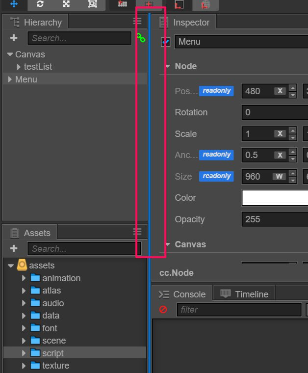
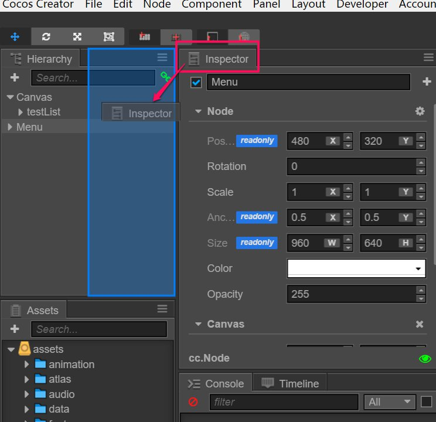
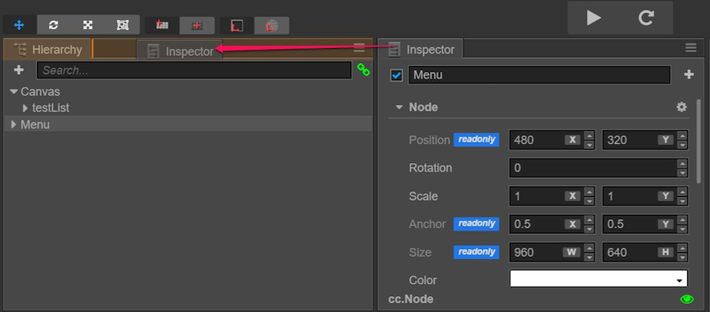
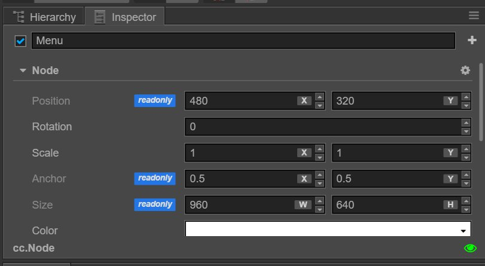

# 에디터 레이아웃

에디터 레이아웃은 코코스 크리에이터 에디터 창에서 패널의 위치, 크기 및 스택을 나타냅니다.

메인 메뉴에서 `Layout` 메뉴를 선택하면 현재 프로젝트에 대해 미리 설정된 패널 레이아웃 중에서 가장 적합한 에디터 패널 레이아웃을 선택할 수 있습니다. 미리 설정된 레이아웃을 기반으로 각 패널의 위치와 크기를 조정할 수 있습니다. 레이아웃 변경은 프로젝트 폴더의 `local/layout.windows.json` 파일에 자동으로 저장됩니다.

## 패널 사이즈 조정

두 패널의 경계선에 마우스를 놓고 커서가 모양이 바뀌면 드래그하여 인접한 두 패널의 크기를 변경합니다.

일부 패널에는 최소 크기 설정이 있으므로 크기 제한에 도달하면 패널 크기를 줄일 수 없습니다.

## 패널 이동하기

패널에서 탭 막대를 클릭하고 드래그하여 전체 패널을 에디터 창에서 원하는 위치로 이동하십시오. 아래 그림의 빨간색 상자는 드래그 할 수 있는 탭 막대 영역을 나타내며 화살표는 끌기 방향을 보여줍니다.

파란색 반투명 ​​상자는 패널을 이동할 때 마우스를 놓으면 패널이 배치될 위치를 나타냅니다.

## 패널 쌓기(Stacking panels)

패널을 이동하는 것 외에도 탭 막대를 끌 때 마우스를 다른 패널의 탭 막대 영역으로 이동할 수 있습니다:

탭 막대가 주황색으로 나타날 때 마우스를 놓아 두 패널을 함께 쌓을 수 있습니다. 한 번에 하나의 패널만 표시 할 수 있습니다:

쌓인 패널은 데스크톱 해상도가 충분하지 않거나 패널 레이아웃 사용률이 낮은 경우 매우 유용할 수 있습니다. 쌓인 패널은 언제든지 드래그 아웃하여 맨 위에 배치된 패널의 표시를 복구 할 수 있습니다.
