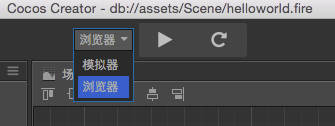
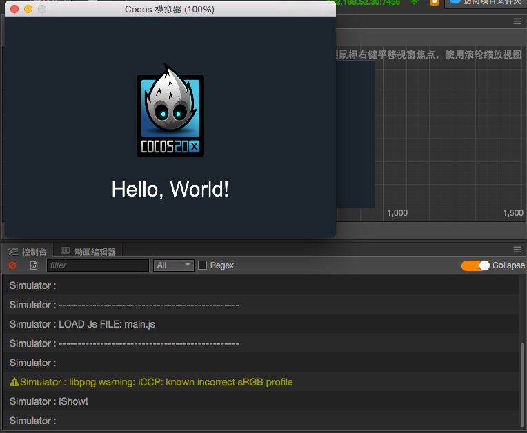
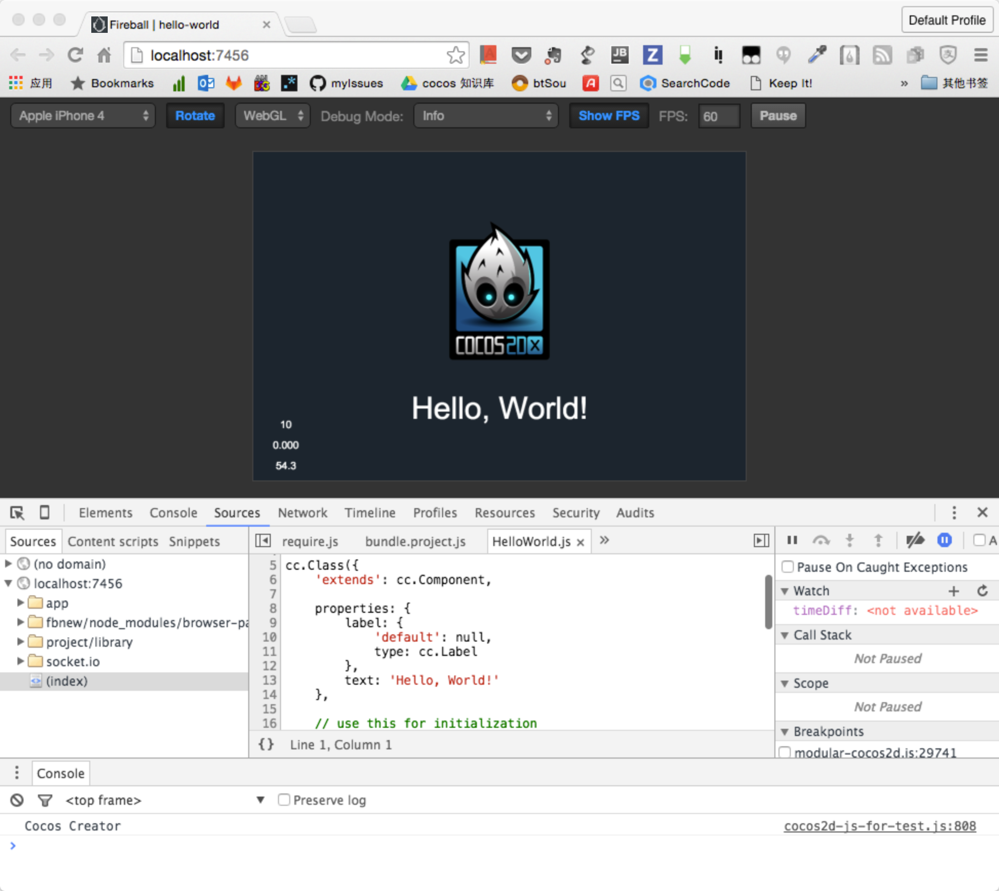

# 빌드(Build)와 미리보기(Preview)

지금까지 에디터의 주요 패널을 소개했으므로 애셋을 관리하고 씬을 만들고 컴포넌트를 조정할 수 있습니다. 그런 다음 대상 플랫폼에서 실행되도록 게임을 미리보고 빌드하십시오.

## 미리보기 플랫폼 설정

에디터 창 상단의 **Preview** 버튼을 클릭하면 실제 게임을 볼 수 있습니다. **Preview** 버튼의 왼쪽에 **Simulator** 및 **Browser**에서 플랫폼을 선택할 수 있습니다.

**Notice** there must be a scene opened before you can see anything in preview.
**주의사항** 최소한 하나의 씬은 있어야 미리보기에서 무언가를 보실 수 있습니다.

### 시뮬레이터

**Simulator**를 선택하고 **Preview**를 클릭하면 Cocos Simulator가 실행되어 현재 게임 씬을 실행합니다.

시뮬레이터가 실행되면 **Console** 패널에서 스크립트 패널이 표시됩니다.

### 브라우저

**Browser**를 선택하고 **Preview**를 클릭하면 기본 브라우저에서 게임이 시작됩니다. 크롬은 개발자도구와 함께 웹 디버깅 및 검사에서 가장 진보된 브라우저이므로 [크롬](http://google.com/chrome)을 선택하는 것이 좋습니다.

미리보기 페이지에는 많은 컨트롤이 있습니다:

- 왼쪽에는 모바일 장치에서 게임이 어떻게 보이는지 시뮬레이트하기위한 뷰포트 크기 설정이 있습니다.
- **Rotate** 버튼을 사용하여 가로 및 세로보기로 전환 할 수 있습니다.
- 왼쪽에서 세 번째 컨트롤은 WebGL과 Canvas 렌더링 모드를 전환하는 것입니다.
- **Debug Mode** 표시되는 로그 수준을 제어 할 수 있습니다.
- **Show FPS** 프레임 속도 토글 및 통화 통계 표시
- **FPS** 프레임 속도 제한.
- **Pause** 게임을 일시 중지합니다.

#### VS Code로 디버깅하기

우리는 VS Code 텍스트 에디터로 프로젝트를 디버그할 수 있습니다. 자세한 내용은 [VS Code를 사용하여 웹 게임 디버깅](../coding-setup.md##use-vs-code-to-debug-web-games)을 참조하십시오.

#### 브라우저 개발자도구로 디버깅하기

예를 들어 크롬을 사용하여 메뉴를 열고 `More Tools/Dev Tools`를 선택하여 개발자 도구를 엽니다. 디버깅 중에 소스 코드, 중단점 추가, 호출 스택 확인 및 단계 제어를 검사할 수 있습니다.

개발자도구 사용에 대한 자세한 내용은 [크롬 개발자도구 유저 가이드] (https://developer.chrome.com/devtools) 또는 다른 브라우저의 개발자 설명서를 참조하십시오.

## 빌드하기

다음 단계는 대상 플랫폼의 장치에서 실행할 수 있도록 게임을 빌드하는 것입니다. 메인 메뉴의 `Project/Build`에서 **Build** 패널을 열면 이 도구로 iOS, Android, HTML5, Windows, Mac, Cocos Play에 게임을 게시할 수 있습니다.

게임 게시에 대한 자세한 내용은 [크로스플랫폼 게임 퍼블리싱](../../publish/index.md)를 참조하십시오.

**주의사항** 시뮬레이터에서 게임을 실행하면 실제 장치에서 게임을 실행하는 것과 같지 않을 수 있습니다. 게임을 출시하기 전에 항상 대상 플랫폼에서 직접 게임을 확인하십시오.
