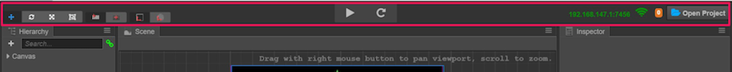
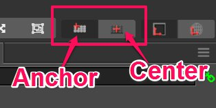
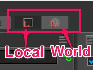
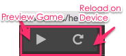
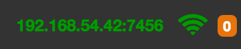
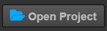

# 툴바(Tool bar)

**툴바**는 기본 패널의 상단에 있으며, 특정 패널에 대한 편집 기능을 제공하고 사용자가 작업흐름을 편리하게 구현할 수 있도록하는 5개의 컨트롤 버튼과 정보들을 포함합니다.

### 변형 도구(Transform Tools)

**Scene Editor**에 대한 편집 노드 변환 속성(위치, 회전, 크기 조절, 크기) 기능을 제공합니다. 자세한 정보는 [변형 도구를 사용하여 노드 배치](editor-panels/scene.md#--8)를 참조하십시오.

### 기즈모 디스플레이 모드(Gizmo Display Mode)

이 컨트롤은 **Scene Editor**에서 **Transform Tool**의 디스플레이 모드를 아래의 두 가지 버튼으로 설정하는 것입니다.

위치 모드(Position mode):

- 앵커 : 노드 **Anchor**가 있는 위치에 변형 도구가 표시됩니다.
- 중점 : 변환 도구는 노드의 중심점이되는 위치에 표시됩니다(경계 상자 크기의 영향을 받음).

회전 모드(Rotation mode):

- Local : 변형 도구의 회전(핸들 방향)은 노드의 **Rotation** 속성과 동일하게 유지됩니다.
* World : 변형 도구의 회전이 동일하게 유지되고 x 축과 y 축의 핸들이 월드 좌표의 방향과 동일하게 유지됩니다.

### 게임 미리보기

여기에는 두 개의 버튼이 포함됩니다:

- 미리보기 실행 : 브라우저에서 현재 편집 중인 씬을 실행합니다.
- 장치 새로고침 :이 컴퓨터에 연결된 모든 장치의 현재 씬을 다시 로드하여 게임을 미리 봅니다(로컬 컴퓨터에 연결된 로컬 브라우저 및 기타 모바일 장치 포함).

### 미리보기 주소

다음은 코코스 크리에이터를 실행하는 데스크톱 컴퓨터의 LAN 주소입니다. 동일한 로컬 영역 네트워크에 연결된 모바일 장치는 이 주소를 액세스하여 게임을 미리보고 디버깅 할 수 있습니다.

### 프로젝트 폴더 열기

운영 체제 탐색기 또는 finder에서 프로젝트 폴더를 엽니다.
