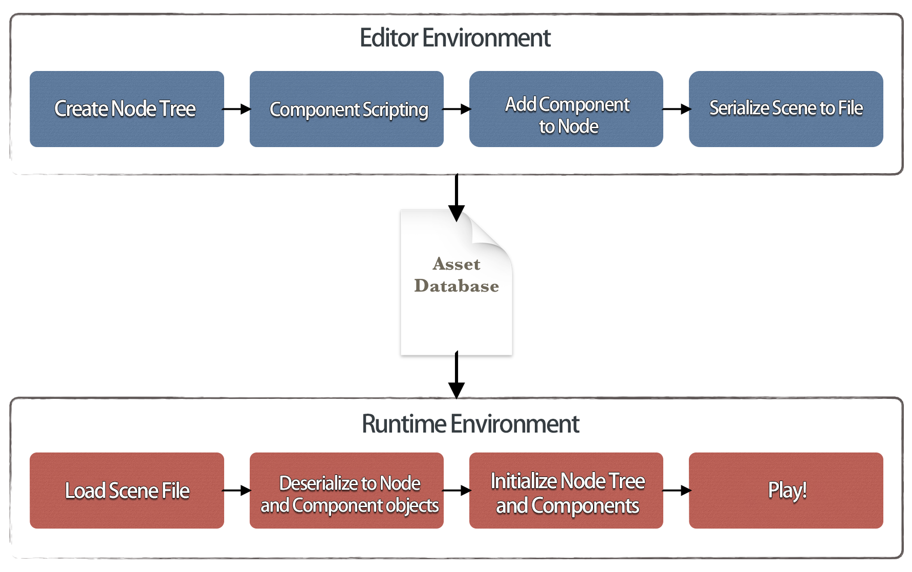
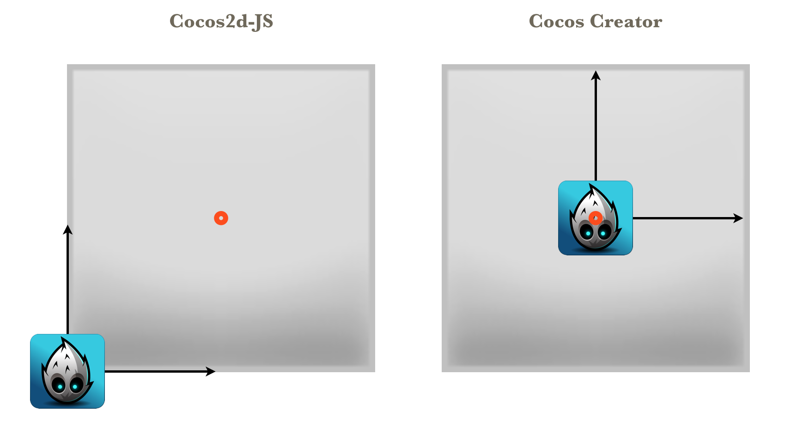

# Cocos2d-x 유저 가이드

코코스 크리에이터는 웹, iOS, 안드로이드, 맥, 윈도우 등의 플랫폼에서 게임 개발을 시작할 수 있도록 완전히 통합된 컴포넌트화된 Cocos2d-x WEB을 통한 컨텐츠 생성을 목표로 하는 새로운 유형의 게임 개발 도구입니다. 당신은 Cocos Play 플랫폼에서 게임을 직접 런칭하여 급속히 발전하는 모바일 웹 게임을 위한 채널로 인한 새로운 기회를 파악할 수 있습니다. 코코스 크리에이터에 대한 자세한 내용은 [소개] (introduction.md)를 참조하십시오.

이 문서의 목적은 Cocos2d-x 사용자에게 코코스 크리에이터를 소개하고 가능한 한 빨리 새 에디터를 사용하는 방법을 배우는 것입니다.
이 문서에서는 Cocos2d-x에서 코코스 크리에이터 개발로 전환할 때 발생할 수 있는 문제에 대해 논의하고 프레임워크 세부사항을 자세히 다루지는 않지만 자세한 참조 문서에 대한 링크를 제공하는 솔루션을 제공합니다.

## 1. 일반적인 오해

새로운 코코스 크리에이터 사용자의 경우 다음과 같은 몇 가지 오해가 발생할 수 있습니다:

1. __코코스 크리에이터를 Cocos2d-x와 함께 사용하길 원하실 때__：코코스 크리에이터는 내부적으로 완전한 자바 스크립트 웹 엔진을 가졌으므로 Cocos2d-x에 의존하지 않고도 작업할 수 있습니다. 그러나 네이티브 플랫폼으로 실행하려면 컴퓨터에 Cocos2d-x를 설정해야합니다.
2. __먼저 전체 코드 프레임워크를 빌드하고 다음 게임 컨텐츠를 추가합니다__：코코스 크리에이티브의 작업흐름은 컨텐츠 제작 지향적이며 프로토 타입 제작에 매우 편리합니다. 씬을 만들고 에디터에서 로직 코드를 직접 작성한 다음 게임 장면을 제어하고 실행할 수 있습니다. 다음 데이터 기반 부분에서는 작업흐름의 변경 사항을 자세히 소개합니다.
3. __코딩할 때 직접 Cocos2d-JS API를 확인합니다__：코코스 크리에이터는 Cocos2d-JS에서 유래했습니다. API는 동일한 출처를 가지며 동일한 부분이 많이 있습니다. 그러나 완전히 새로운 컴포넌트가 있는 프레임워크의 경우 해당 API는 서로 다르며 서로 호환되지 않습니다.
4. __코코스 크리에이터에서 예전 Cocos2d-JS 게임을 직접 실행하길 희망합니다__：API는 100 % 호환되지 않습니다. 따라서 이러한 작업을 수행 할 수 없습니다.
5. __상속을 통한 함수 확장__：Cocos2d-JS에서 상속은 노드 기능을 확장하기 위한 기본 방법입니다. 그러나 코코스 크리에이티브에서 상속 및 확장 노드는 권장하지 않습니다. 노드는 엔티티일뿐입니다. 게임의 로직은 다른 컴포넌트에 의해 구현되어야하고 노드에서 조립되어야합니다.

이 문서의 시작 부분에서 이러한 오해를 언급한 이유는 개발자가 코코스 크리에이터의 작업흐름과 개발 아이디어가 Cocos2d-x의 작업흐름와 개발 아이디어와 크게 다르다는것을 알기 바라기 때문입니다.
코코스 크리에이터에서 올바르게 코딩하는 방법을 더 잘 이해하기 위해, 데이터에 의한 작업흐름 및 API 수준의 변화를 보다 자세히 설명합니다.

## 2. 데이터 기반

Cocos2d-x에서 개발 방법은 코드에 의해 주도되며 개발자가 자신의 데이터 기반 프레임워크를 만들지 않는 한 대부분의 게임 데이터는 코드에 저장됩니다.
코코스 크리에이터의 프레임워크에서는 모든 씬이 순수한 데이터로 직렬화됩니다. 이 순수한 데이터가 실행되면 씬, 인터페이스, 애니메이션 및 컴포넌트 등의 요소를 리빌드되는데 사용됩니다.

### 코드 기반과 데이터 기반은 무엇인가요?

Cocos2d-x를 코드 기반 개발 방법이라고 부르는 이유는 무엇입니까? 예를 들어 씬에 캐릭터가 있고, 한 영역에서 계속 걸어다니면 다음과 같이 코딩합니다:

```
var role = new cc.Sprite('role.png');
scene.addChild(role);
role.setPosition(100, 100);
var walk = cc.sequence(cc.moveBy(5, 100, 0), cc.moveBy(5, -100, 0)).repeatForever();
role.runAction(walk);
```

이 코드에서 씬과 노드의 관계, 위치 정보, 동작 및 "role"의 애니메이션 정보는 모두 코드로 구현됩니다. 따라서 코드 기반이라고 합니다. 또한 다른 문서에 데이터 정보를 저장하는 개발자도 있지만 데이터 파서 자체를 구현해야합니다. 일부 전통적인 에디터를 사용하는 경우에도 에디터에서 내보낸 데이터를 구문 분석 할 때 구문 분석기가 필요합니다.

그러나 코코스 크리에이터가 제공하는 것은 보다 철저한 데이터 기반 방법입니다. 에디터에서 편집한 모든 정보는 데이터 문서로 직렬화됩니다. 실행 중일 때 엔진은 직렬화 변환을 통해 데이터를 객체로 직접 변환합니다. 이 절차는 위에서 설명한 절차와 근본적으로 다릅니다. 엔진의 범주 속성을 직접 직렬화 또는 역직렬화할 수 있습니다. 매핑 관계로 변환 할 필요가 없습니다. 위의 예제에서 씬 그래프, 위치 속성 및 애니메이션 등은 모두 편집기에서 데이터로 직렬화 할 수 있습니다. 씬을 불러올 때 데이터가 필요하지 않은 경우 개발자는 씬 데이터에서 전체 씬을 역직렬화하면됩니다:

```
cc.director.loadScene('SampleScene');
```

### 직렬화(Serialization)

직렬화 및 역직렬화는 코코스 크리에이티브에서 대부분의 공용 속성을 지원합니다. 이러한 속성은 속성 패널을 통해 개발자에게 노출됩니다. 개발자는 임의로 에디터에서 속성을 수정하고 저장할 수 있습니다. 저장 절차는 리소스 및 씬 데이터를 에셋 데이터베이스로 직렬화하는 것입니다. 대조적으로 씬 로드 절차에서 역직렬화 메커니즘은 씬 데이터에 따라 해당 오브젝트를 인스턴스화하고 에디터에 설정된 모든 특성을 복원할 수 있습니다.

또한 사용자가 직접 편집한 컴포넌트에서 속성을 선언할 수 있다는 사실에 기반하여 데이터 기반이 강화되었습니다. 이러한 속성은 에디터에서 편집하고 씬 데이터에 저장하며 마지막으로 실행시 게임 장면으로 역직렬화 할 수 있습니다.

_ 소스 데이터베이스는 편집기에서 [에셋](basics/editor-panels/assets.md)로 표시됩니다 ._

### 데이터 중심의 작업흐름 이해

코코스 크리에이터의 작업흐름은 Cocos2d-x와는 달리 컨텐츠 생성을 지향합니다. 개발자는 전환 과정에서 다양한 종류의 혼란을 겪을 수 있습니다. 그러나 데이터 중심에서 볼 때 이러한 작업흐름의 변경은 당연한 것입니다. 데이터 기반으로 씬을 자유롭게 편집 할 수 있습니다. 개발자는 전체 씬을 시각적으로 구축 할 수 있을뿐만 아니라 게임 로직(컴포넌트에 의해 노출된 속성 편집)도 편집 할 수 있으므로 에디터가 코드가 아닌 모든 것에 액세스 할 수 있습니다. 앞의 예와 마찬가지로 코코스 크리에이터에서는 개발자가 먼저 부모 - 자식 관계를 만들고 위치를 설정하고 에디터로 애니메이션을 디자인한 다음 컴포넌트 코드를 사용하여 씬의 노드 로직을 디자인합니다. 마지막에는 다른 노드에 컴포넌트를 조립합니다.



## 3. 프레임워크 레벨에서의 변화들

코코스 크리에이터는 초기에 언급했듯이 컴포넌트화 된 Cocos2d-JS와 완전히 통합되었습니다. 이것은 고도로 맞춤화된 에디션입니다. 컴포넌트화와 데이터 중심의 요구로 인해 API 세트와 Cocos2d-JS의 표준 에디션은 동일한 출처를 가지지만 그 중 두 가지는 서로 호환되지 않습니다. 다음은 몇 가지 중요한 API 차이점에 대한 자세한 설명입니다.

### 로직 트리(Logic Tree)와 랜더 트리(Render Tree)

Cocos2d-JS에서 렌더링 장치는 씬의 노드 트리를 가로질러 렌더 큐를 생성합니다. 따라서 개발자가 만든 노드 트리는 사실 렌더링 트리입니다. 그러나 코코스 크리에이터에서는 새로운 개념인 로직 트리를 도입합니다. 개발자 및 장착 컴포넌트에 의해 구축 된 노드 트리는 로직 트리를 구성하며, 노드 내에서 노드는 엔티티 단위를 구성하고 컴포넌트는 로직을 담당합니다.

가장 중요한 차이점은 다음과 같습니다. 로직 트리가 우려하는 것은 게임 로직이지만 렌더링 관계는 아닙니다.

로직 트리는 씬의 렌더링 트리를 생성하고 렌더링 순서를 결정합니다. 그러나 개발자는 이러한 것에 대해 걱정할 필요가 없으며 에디터에서 제대로 표시되는지만 확인하면됩니다. 에디터의 [노드 트리](basics/editor-panels/node-tree.md)에서 개발자는 로직 트리의 순서와 부모 - 자식 관계를 조정할 수 있습니다.

### 씬 관리(Scene Management)

Cocos2d-JS에서는 코드로 씬을 구현한 후 개발자가 'cc.director.runScene'을 사용하여 씬을 전환할 수 있습니다. 코코스 크리에이터에서 개발자가 씬을 에디터로 작성하면 모든 데이터가 'scene-name.fire' 문서로 저장되고 에셋 데이터베이스에 저장됩니다. 개발자는 `cc.director.loadScene`을 사용하여 씬 리소스를 로드 할 수 있습니다. 다음 구체적인 예를 참조하십시오:

```
var sceneName = 'scene-name';
var onLaunched = function () {
    console.log('Scene ' + sceneName + ' launched');
};
// 첫번쨰 매개 변수는 씬의 이름입니다. 두번째 선택적 매개 변수는 씬이 로드된 이후에 호출하는 콜백 함수입니다.
cc.director.loadScene(sceneName, onLaunched);
```

게다가 방문 노드에 대한 인터페이스가 제공됩니다.

```
// 로직 트리에서 씬 노드를 얻으려면
var logicScene = cc.director.getScene();
```

### 노드(Node)와 컴포넌트(Component)

코코스 크리에이터에서 'cc.Node'는 로직 노드로 대체되고 이전 노드는 '_ccsg.Node'로 이름이 바뀌고 더이상 사용하지 않게 되었습니다. 그 이유는 개발자가 로직 노드에만 집중할 필요가 있고 더 이상 렌더링 노드를 신경 쓸 필요가 없기 때문입니다. 물론 API 세트를 가능한 많이 보존했습니다. 변환, 노드 트리, 조치 및 특성과 관련된 정보와 같은 API는 변경되지 않습니다.

이전에는 컴포넌트의 크루드(crude) 메커니즘이있었습니다. 개발자는 노드에 컴포넌트를 추가하여 onEnter, onExit, update 등과 같은 콜백을 수신할 수 있습니다. 코코스 크리에이터에서는 동일한 인터페이스 `addComponent`가 사용되지만 컴포넌트 시스템은 전체 엔진의 핵심이 됩니다. 컴포넌트는 다양한 방식으로 로직 노드의 기능을 확장할 수 있습니다. 로직 노드는 실제 게임 로직을 포함하면 안되며 다양한 로직 컴포넌트에 의해서만 로직이 완벽하게 조립되어야한다고 말할 수 있습니다.

그리고 이것이 Cocos2d-JS와 코코스 크리에이터 사이의 가장 큰 차이로 연결됩니다 : 노드 동작을 확장하는 방법?

Cocos2d-JS에서 개발자는 다양한 유형의 노드에 대한 동작 확장을 실현할 수 있습니다. 그러나 코코스 크리에이티브에서 이러한 조작은 금지되어 있습니다. 모든 확장은 컴포넌트를 추가하여 실현되어야합니다. 상속과 집회 사이의 경합은 오랫동안 유지되어 왔으며 여기서는 자세히 다루지 않을 것입니다. 그러나 코코스 크리에이터와 같은 컴포넌트화된 프레임워크에서 어셈블리는 가장 자연스러운 확장 방법입니다.

컴포넌트 시스템에 대한 자세한 내용은 [노드 컴포넌트] (../content-workflow/node-component.md)을 참조하십시오.

### 좌표 시스템(Coordinate System)과 앵커 포인트(Anchor Point)

코코스 크리에이터의 좌표계는 여전히 직교 좌표계이지만 앵커 포인트에는 몇 가지 변화가 있습니다. 설명을 읽기 전에 다이어그램을 보십시오 :



컨텍스트 노드의 앵커 포인트가 (0.5, 0.5)라고 가정합니다. 이 노드는 하위 노드를 가지며 앵커 포인트는 (0, 0)입니다. Cocos2d-JS에서는 그 그림이 왼쪽 다이어그램과 같습니다. 그러나 코코스 크리에이터에서 그 그림은 올바른 다이어그램과 같습니다. 그 이유는 서브 노드의 로컬 좌표계가 다르다는 것입니다. Cocos2d-JS에서는 부모 노드의 앵커 포인트가 있는 모든 위치에서 하위 노드의 좌표계의 원점은 부모 노드의 왼쪽 아래 모서리에 있습니다. 그러나 코코스 크리에이티브에서 서브 노드 좌표계의 원점은 부모 노드의 좌표 위치(즉, 앵커 포인트)의 위치에 있습니다. 이러한 수정은 에디터와 더 잘 호환되며 일반적으로 에디터가 만든 씬에 매우 자연스럽습니다. 그러나 개발자가 코드를 사용하여 노드를 만들 때 특별한 주의를 기울여야합니다.

### 변경되지 않고 남아있는 카테고리와 오브젝트

코코스 크리에이터에서 우리는 다음과 같은 많은 중요한 카테고리와 오브젝트를 보존했습니다:

- `cc.game`
- `cc.view`
- `cc.director`
- `cc.audioEngine`
- `cc.eventManager`
- [`cc.scheduler`](../scripting/scheduler.md)
- `cc.textureCache`
- `cc.sys`
- `cc.visibleRect`
- [scripting actions](../scripting/actions.md)
- 몇몇 렌더 노드: Menu, MenuItem, ClippingNode, ProgressTimer, MotionStreak, RenderTexture, DrawNode, Tile map 등.
- Chipmunk 물리 엔진과 PhysicsDebugNode
- 기본 데이터 유형

유의사항:

1. 위에 나열된 보존 된 렌더 노드 유형은 렌더링 트리와만 상호 작용할 수 있으며 로직 노드 및 컴포넌트와 함께 사용할 수 없습니다.
2. 액션 시스템은 렌더 노드뿐만 아니라 변형(Transform)하는 모든 액션도 로직 노드를 지원합니다.
3. `cc.scheduler`는 `schedule`,`scheduleOnce`,`unschedule`,`unscheduleAllCallbacks`와 같은 인터페이스를 포함하는 컴포넌트를 지원합니다.
4. 이벤트 매니저는 유지되지만, 로직 노드는 일련의 새로운 이벤트 API를 갖습니다. 이벤트 관리자를 직접 사용하지 않는 것이 좋습니다. 자세한 내용은 아래 이벤트 시스템 소개를 참조하십시오.

### 이벤트 시스템(Event System)

`cc.Node`에는 일련의 완전히 새로운 이벤트 API가 추가되었습니다. 로직 노드에서 다양한 이벤트를 분배할 수 있습니다. 어떤 종류의 이벤트에 대한 모니터의 등록도 허용됩니다. 모니터는 간단한 콜백 함수이거나 콜백 함수와 호출자의 조합일 수 있습니다. 중요한 API 목록 :

1. `node.emit(type, detail)`: 모든 모니터에 `type` 이벤트를 모니터하도록 알립니다. 추가 매개변수를 전달할 수 있습니다.
2. `node.dispatchEvent(event)`: 모니터에 이벤트를 보냅니다. 버블링을 지원합니다.
3. `node.on(type, callback, target)`: 지속적으로 `node`의 `type` 이벤트를 모니터링합니다.
4. `node.once(type, callback, target)`: `node`의 `type` 이벤트를 한 번 모니터링합니다.
5. `node.off(type, callback, target)`: 모든 `type` 이벤트의 모니터링을 취소하거나 `type` 이벤트의 특정 모니터를 취소합니다(콜백과 타겟에 의해 지정됨).

이러한 이벤트 배포 방법은 `cc.eventManager`에 의한 중앙 집중식 배포에서 이벤트 자체가 있는 노드에 의한 배포로 변경되었습니다. 중앙 집중식 이벤트 시스템에서 개별 이벤트 시스템으로의 변환이라고 할 수 있습니다. 그 동안 코코스 크리에이티브는 노드에 두 종류의 시스템 이벤트(MOUSE와 TOUCH)를 내장했습니다.

| enumeration object | 해당 이벤트 이름 |
| ---------- |:----------:|
| `cc.Node.EventType.TOUCH_START` | 'touchstart' |
| `cc.Node.EventType.TOUCH_MOVE` | 'touchmove' |
| `cc.Node.EventType.TOUCH_END` | 'touchend' |
| `cc.Node.EventType.TOUCH_CANCEL` | 'touchcancel' |
| `cc.Node.EventType.MOUSE_DOWN` | 'mousedown' |
| `cc.Node.EventType.MOUSE_ENTER` | 'mouseenter' |
| `cc.Node.EventType.MOUSE_MOVE` | 'mousemove' |
| `cc.Node.EventType.MOUSE_LEAVE` | 'mouseleave' |
| `cc.Node.EventType.MOUSE_UP` | 'mouseup' |
| `cc.Node.EventType.MOUSE_WHEEL` | 'mousewheel' |

이제 개발자는 노드의 다양한 MOUSE 및 TOUCH 이벤트에 직접 응답할 수 있습니다. 접촉점이 노드에 포함되어 있는지 여부를 더 이상 판단할 필요가 없습니다. 또한 새 이벤트 시스템은 이벤트 버블링을 지원합니다. 노드에서 TOUCH 이벤트가 트리거되었다고 가정하면, 이벤트 모니터가 버블링을 중지하지 않으면 상위 노드가 동일한 TOUCH 이벤트를 트리거합니다. 이벤트 시스템에 대한 구체적인 사용 방법은 [스크립팅 이벤트] (../scripting/ events.md)를 참조하십시오.

## 4. 다음 단계

매우 일반화된 방식으로, 위의 텍스트는 코코스 크리에이터 뒤에 숨어있는 디자인 아이디어와 Cocos2d-JS에서 전환 할 때 발생할 수 있는 장애물에 대해 소개했습니다. 모든 내용이 여기에서 다루어지는 것은 아니며 이 문서의 목적도 아닙니다. 이 문서의 목적은 Cocos2d-x 사용자가 코코스 크리에이터를 더 쉽게 사용하는 방법을 배우는 것입니다. 코코스 크리에이터 사용자 가이드를 계속 읽고 모든 작업흐름과 코딩 기술을 배우십시오.

---

계속해서 [프로젝트 구조](project-structure.md)에 대해 읽어보세요.
