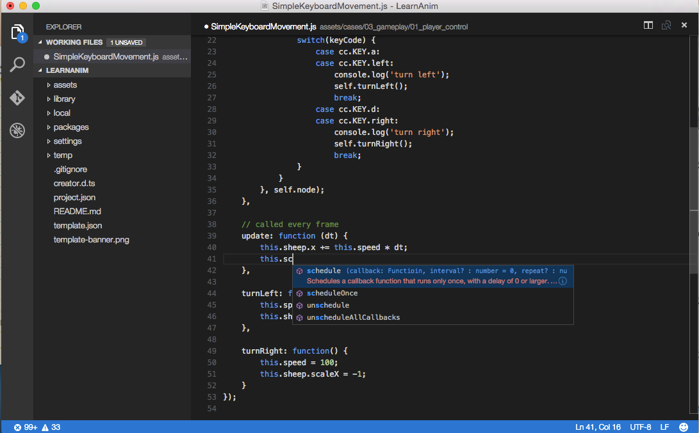

# 코딩 환경 설정

퀵스타트 튜토리얼에서 스크립트 파일을 더블 클릭하여 코드 에디터로 편집하는 방법을 보여드렸습니다. 그러나 내장된 코드 에디터는 오직 빠른 편집과 스크립트의 리뷰에만 특화되어있으며 여러분이 원하시는 많은 기능이 부족합니다. 그래서 코코스 크리에이터에서 권장하는 코딩 환경과 이를 설정하는 방법에 대해 소개합니다.

## Visual Studio Code

[Visual Studio Code](https://code.visualstudio.com/) （이하 VS Code）는 가벼운 크로스 플랫폼 개발 환경입니다. 자바스크립트 편집 및 디버깅을 위한 훌륭한 기능을 갖추고 있으며 VS Code를 위한 확장 기능을 통해 API 자동 완성 및 기본 디버깅 지원이 제공됩니다.


### VS Code 설치하기

[VS Code 홈페이지](https://code.visualstudio.com/)로 가셔서 다운로드 버튼을 클릭하시면 소프트웨어 패키지를 다운받으실 수 있습니다.

맥 사용자는 원하는 위치에 압축을 푸시고 `Visual Studio Code.app`을 더블 클릭해서 실행하세요.

윈도우 사용자는 `VSCodeSetup.exe`로 설치하시면 됩니다.

### 코코스 크리에이터 API 확장기능 설치

코코스 크리에이터에서 당신의 프로젝트를 여신 후, 메인 메뉴의 `Developer/Install VS Code Extension`를 선택하세요.

이것은 코코스 크리에이터 API 확장기능을 VS Code의 확장 라이브러리에 설치합니다. 보통 사용자 홈 폴더에 `.vscode/extensions` 경로입니다. 코코스 크리에이터를 업데이트하지 않는 한 확장 프로그램은 한 번만 설치해야합니다.

**Console** 패널에서 `VS Code extension installed to ...`를 확인하실 수 있습니다.

### 당신의 프로젝트에서 API 소스 만들기

구문 강조와 자동완성을 위해 프로젝트 폴더에 API 소스를 생성해야 합니다.

메인 메뉴에서 `Developer/Update VS Code API Source`를 선택합니다. 프로젝트의 루트(`assets` 폴더와 같은 레벨)에 `creator.d.ts` 파일을 생성합니다. 완료되면 `API data generated and copied to ...`는 메시지를 보실 수 있습니다.

이 작업은 API 소스가 업데이트되었거나 어떤 이유로든 프로젝트에 `creator.d.ts` 파일이 없는 경우에만 필요합니다.

**주의사항 ** VS Code 0.10.11 이후로 프로젝트가 작동하려면 `jsconfig.json`도 필요합니다. 위의 명령은 `creator.d.ts`와 함께 미리 정의된 `jsconfig.json` 파일을 프로젝트에 복사합니다. [VS Code 자바스크립트 가이드] (http://code.visualstudio.com/docs/languages/javascript)에 따라`jsconfig.json`을 커스터마이징해보세요.

### VS Code로 프로젝트 열기

VS Code를 실행하고 메인 메뉴에서 `File/Open...`를 선택한 다음 프로젝트의 루트 폴더를 선택하고 `Open`를 클릭하십시오.

이제 새 스크립트를 만들거나 기존 스크립트를 편집하고 자동 완성 및 구문 강조를 즐길 수 있습니다.



**주의사항** `creator.d.ts` 및 `jsconfig.json` 파일은 VS Code로 여는 폴더에 있어야만 전체 언어 및 API 자동 완성 작업을 할 수 있습니다.

### 파일 트리와 검색 필터 설정

VS Code 메인 메뉴에서 `Code/Preferences/User Settings`을 선택하십시오. 편집을 위해 사용자 설정 파일이 열립니다. 다음 내용을 추가해 보겠습니다:

```json
    "search.exclude": {
        "**/node_modules": true,
        "**/bower_components": true,
        "build/": true,
        "temp/": true,
        "library/": true,
        "**/*.anim": true
    },
    "files.exclude": {
        "**/.git": true,
        "**/.DS_Store": true,
        "**/*.meta": true,
        "library/": true,
        "local/": true,
        "temp/": true
    }
```

위의 설정은 코코스 크리에이터가 생성 및 관리하는 폴더를 검색 및 파일 트리에서 제외합니다.

### VS Code를 사용하여 웹게임 디버그하기

VS Code는 뛰어난 디버깅 기능을 가지고 있으며 VS Code의 소스 프로젝트에서 게임 프로그램의 웹 버전을 직접 디버깅 할 수 있습니다.

먼저 다음과 같은 사항들을 설치해주세요:

- [크롬 (구글 크롬)] (https://www.google.com/chrome/)
- VS Code 확장기능: 크롬용 디버거

VS Code 확장을 설치하려면 VS Code의 왼쪽 탐색줄에 있는 'Extensions' 버튼을 클릭하여 확장 패널을 열고 검색 상자에 `Debugger for Chrome`을 입력하고 `Install`를 클릭하여 계속하십시오. 설치가 끝나면 VS Code를 다시 시작해야 적용됩니다.

그런 다음 코코스 크리에이터 에디터의 메인 메뉴에서 `VS Code Workflow -> Add Chrome Debug Setting`를 실행하십시오. 이 메뉴 명령은 `.vscode/launch.json` 파일을 디버거 구성으로 프로젝트 폴더에 추가합니다. 그런 다음 VS Code에서 왼쪽 사이드 바에서 'Debug' 버튼을 클릭하여 디버그 패널을 열고 디버그 구성 상단에서 `Creator Debug: Launch Chrome`을 선택한 다음 녹색 시작 버튼을 클릭하여 디버깅을 시작합니다.

디버깅 프로세스는 코코스 크리에이터 에디터가 내장된 웹 서버에 따라 다르므로 디버그가 작동하도록 에디터를 실행해야합니다. 에디터가 기본이 아닌 포트를 사용하여 게임을 실행하는 경우, 올바른 포트를 추가하기 위해 `launch.json`의 `url` 필드를 수동으로 수정해야합니다.

우리는 직접 소스 파일에 중단점을 추가하고, 변경하고, 재컴파일하고, 디버깅 프로세스를 계속할 수 있습니다. 이 작업흐름은 크롬의 기본 개발자도구를 사용하는 것보다 편리합니다.

### VS Code를 사용하여 네이티브 프로젝트 디버깅하기

네이티브 프로젝트의 디버깅 작업흐름에 대해 알아보시려면 [네이티브 플랫폼 디버깅] (../publish/debug-native.md)을 참조하세요.


### VS Code에 대해서 더 알아보기

[VS Code 문서 페이지](https://code.visualstudio.com/Docs)로 가셔서, 편집, 커스터마이징, 확장 기능 등 VS Code에 대해 더 알아보실 수 있습니다.


<hr>

Cocos2d-x 사용자라면 아래 문서를 읽어보세요:

- [Cocos2d-x 유저 가이드](cocos2d-x-guide.md)
