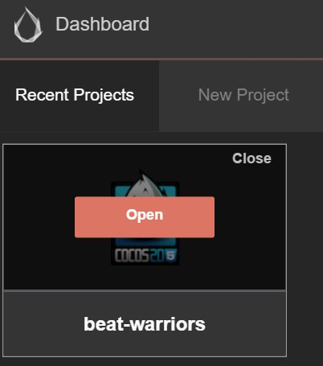

# 대시보드

코코스 크리에이터를 시작하고 코코스 개발자 계정으로 로그인하면 대시보드 인터페이스가 열립니다.
새 프로젝트를 만드시거나 기존의 프로젝트를 여실 수도 있으며 도움이 되는 정보를 얻으실 수 있습니다.

## 인터페이스 개요

위에 나열된 것은 코코스 크리에이터의 대시보드 인터페이스로서, 다음과 같은 종류의 탭들을 포함합니다:

- **최근에 열었던 프로젝트들**: 최근에 열었던 프로젝트들을 나열합니다. 코코스 크리에이터가 처음 실행되면 목록은 비어있고 'Creat a new project' 버튼이 나타납니다.
- **새 프로젝트 만들기**: 이 탭을 클릭하면, 코코스 크리에이터에서 새로운 프로젝트를 만들기 위한 가이드 인터페이스에 접근할 수 있습니다.
- **다른 프로젝트 열기**: 프로젝트가 최근에 열었던 프로젝트 목록에 없으면, 이 버튼을 클릭하여 열고자 하시는 프로젝트를 선택하실 수 있습니다.
- **도움말**: 도움말 정보는 초보자를 위한 유용한 정보와 안내를 포함하는 정적인 문서 페이지입니다.
- **퀵스타트**: 코코스 크리에이터를 이용하여 빠르게 게임을 개발하시는데 도움이 되는 비디오 튜토리얼을 제공합니다.

다음으로, 각 서브 페이지들을 하나씩 소개할 것입니다.

### 최근에 열었던 프로젝트들

**Recently Opened Projects**를 이용하여 최근에 열어본 프로젝트에 빠르게 접근하실 수 있습니다. 처음으로 코코스 크리에이터를 실행하시면 목록은 비어있고 'Creat a new project' 버튼이 나타납니다. 프로젝트를 만드신 후 다시 되돌아오실 수 있으며 새로 생성된 프로젝트가 목록에 표시됩니다.

최근에 열어보신 프로젝트 위에 마우스를 올리시면, 다음과 같은 가능한 명령들이 나타납니다:

- **Open**을 클릭하시고 이 프로젝트를 코코스 크리에이터에서 엽니다.
- **Close**를 클릭하시고 최근에 열었던 프로젝트 목록에서 이 프로젝트를 제거합니다. 이 작업은 실제 프로젝트 폴더를 삭제하지는 않습니다.

또한 프로젝트를 클릭하거나 마우스를 가져가면 대시보드 아래의 상태표시줄에서 프로젝트의 경로를 보실 수 있습니다.

### 새 프로젝트 만들기

**Creat a New Project** 탭을 사용하여 새로운 코코스 크리에이터 프로젝트를 생성하실 수 있습니다.

**Creat a New Project** 페이지에서 먼저 프로젝트 템플릿을 선택합니다. 프로젝트 템플릿은 다양한 기본 게임의 프레임워크와 샘플 리소스, 학습용 스크립트가 포함되어있어 보다 빠르게 작업을 시작하실 수 있습니다.

*참고: 초기 코코스 크리에이터 에디션에는 여러 개의 프로젝트 템플릿 옵션이 포함되어 있지 않습니다. 코코스 크리에이터의 기능 향상과 함께 점차적으로 템플릿을 추가하여 사용자들에게 편의성을 제공합니다.

템플릿을 클릭하면, 페이지의 하단에 템플릿에 관한 설명을 보실 수 있습니다.

페이지 하단에 저장할 프로젝트 이름과 경로가 표시됩니다. 프로젝트 경로의 입력창에서 프로젝트 경로와 프로젝트 이름을 수동으로 입력하실 수 있습니다. 경로의 마지막 부분이 프로젝트 이름입니다.

**Browse** 버튼을 클릭하여 찾아보기 경로의 입력창을 여실 수도 있습니다. 로컬 파일 시스템에서 새 프로젝트를 저장하실 위치를 지정합니다.

모든 것이 설정되면, **Creat a New Project** 버튼을 클릭하여 프로젝트 생성을 완료합니다. 대시보드 인터페이스가 닫히고 새로 생성된 프로젝트가 코코스 에디터의 메인 창에서 열립니다.

### 다른 프로젝트 열기

**Recently Opened Projects** 페이지에서 프로젝트를 찾을 수 없으시거나 이전에 한번도 열어본 적이 없는 프로젝트를 다운로드 받으신 경우 **Open Other Projects** 버튼을 클릭하여 로컬 파일 시스템에서 프로젝트를 찾아 여실 수 있습니다.

**Open Other Projects**를 클릭하시면, 로컬 파일 시스템의 입력창이 나타납니다. 이 입력창에서 프로젝트 폴더를 선택하시고 "Open"을 클릭하시면 프로젝트가 열립니다.

*참고: 코코스 크리에이터는 부분적으로 정상적으로 만들어진 프로젝트로서 구조화된 폴더를 사용하지만 이는 생성 문서 파일이 아닙니다. 프로젝트 폴더를 클릭하셔서 프로젝트를 선택하시면 됩니다.*

### 도움말

**Help** 페이지를 클릭하시면 코코스 크리에이터 유저 메뉴얼과 다른 도움이 되는 문서들을 보실 수 있습니다.

---

계속해서 [헬로 월드!](hello-world.md)를 읽어보세요.
