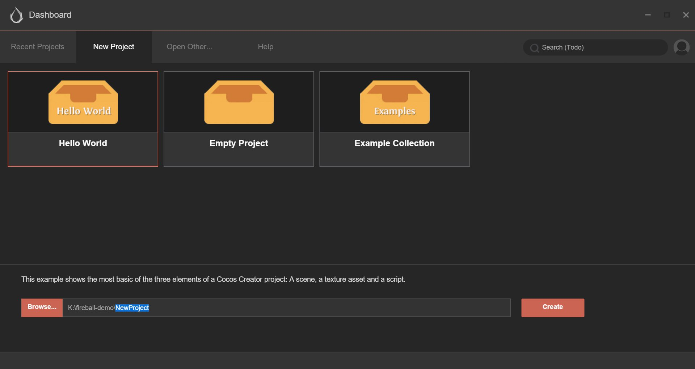

# 헬로 월드

대시 보드 사용법을 이해하셨으면 이제 헬로 월드 프로젝트를 만들어보겠습니다.

## 새 프로젝트 만들기

대시보드에서 **Create a New Project** 탭을 선택하시고 `Hello World` 프로젝트 템플릿을 골라주세요.

그런 다음 아래의 프로젝트 경로 바에서 새 프로젝트의 경로를 지정해주세요. 마지막 부분의 경로는 프로젝트 폴더입니다.

경로를 입력하신후, 우측 하단의 **Create a New Project** 버튼을 클릭하시면 자동으로 헬로 월드 프로젝트 템플릿으로 프로젝트가 만들어져 열립니다.

## 시작을 위해서 씬(Scene) 열기

코코스 크리에이터의 핵심은 데이터 기반 작업흐름입니다. 처음으로 프로젝트를 열면, 기본으로 아무런 씬도 열리지 않습니다. 헬로 월드 템플릿의 내용을 보시려면 먼저 씬 에셋 파일을 열어야 합니다.

Double click the `Hello World` scene asset file indicated by the arrow, in **Assets** panel. All the scene assets in 코코스 크리에이터 use  as their icon.
**Assets** 패널에서 화살표로 표시되는 `Hello World` 씬 에셋 파일을 더블 클릭합니다. 코코스 크리에이터의 모든 씬 에셋은 을 아이콘으로 사용합니다.

## 헬로 월드 프로젝트 분석

`Hello World` 씬을 여시면, 프로젝트의 모든 내용을 보실 수 있습니다.

씬의 내용은 작업흐름에 따라 **에셋(Assets), 노드 트리(Node Tree), 씬(Scene), 속성(Properties)**의 네가지 핵심 패널에서 각각 사용할 수 있습니다. 에디터 인터페이스 및 기본 패널에 대한 소개는 [에디터 개요](basics/editor-overview.md)에 자세히 설명되어 있습니다.

## 씬 미리보기

게임 씬을 미리보기 위해서, 에디터창 상단의 **미리보기(Preview)** 버튼을 클릭합니다.

코코스 크리에이터는 현재 게임 씬을 실행하기 위해 기본으로 설정된 브라우저를 사용합니다:

미리보기 창의 왼쪽 상단 모서리에 있는 드롭다운 메뉴를 선택하시면 미리보기 화면을 다른 디바이스 화면으로 교체하실 수 있습니다.

## 환영 메시지 바꿔보기

간단한 예제를 통하여 데이터 기반 작업흐름을 보여드리고자 합니다. Hello World라는 환영 메시지를 바꾸기 위해서 스크립트 코드를 편집할 필요 없이 씬에서 해당 단어의 속성을 직접 변경할 수 있습니다.

먼저 `Hello World` 컴포넌트 스크립트가 첨부된 **Node Tree**에서 `캔버스(Canvas)` 노드를 클릭합니다

다음으로 **Properties** 하단의 `Hello World` 컴포넌트 속성을 찾으시고 `Text` 속성의 값을 `Hello, world!`로 변경해보세요.

미리보기를 다시 실행해보시면, 메시지가 업데이트된 것을 확인하실 수 있습니다:

## 마무리

이 섹션에서는 코코스 크리에이터에서 씬 작업을 시작하는 방법에 대해 알려드렸습니다. 그리고 환영 메시지를 데이터 기반 작업에 의해 수정하는 방법에 대해 간략히 소개드렸습니다. 다음으로 단계별로 완전한 레저 게임을 만드는 방법에 대해 알아볼 것입니다. 그러면 코코스 크리에이터의 작업흐름에 대해 보다 포괄적으로 이해하실 수 있을 것입니다.

---

계속해서 [퀵스타트](quick-start.md)를 읽어보세요.
