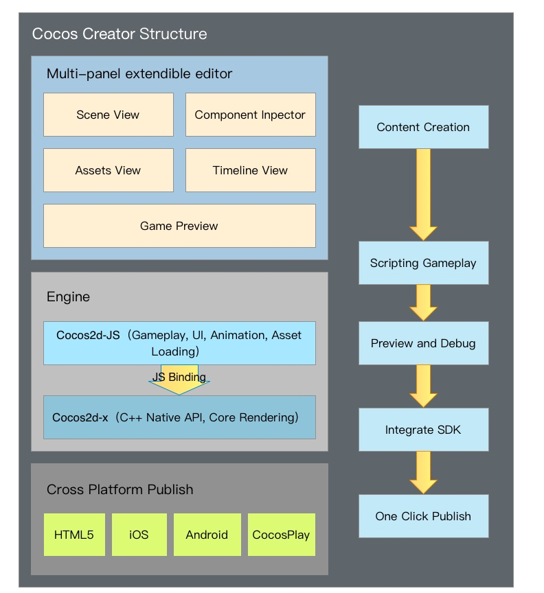
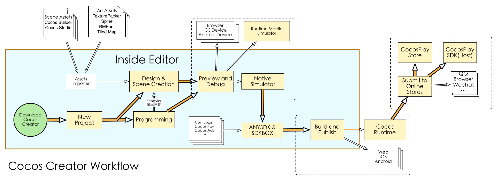

# 코코스 크리에이터에 대하여

- **Q**: 코코스 크리에이터는 게임 엔진인가요?
- **A**: 완전한 게임 개발 솔루션으로서, Cocos2d-x로 구현된 자바스크립트를 포함하며(새로운 엔진을 배울 필요가 없습니다),
 다양한 UI 도구들을 통하여 게임을 보다 빠르게 개발할 수 있도록 도와줍니다.

- **Q**: 코코스 크리에이터는 어떤 종류의 에디터를 가지고 있나요?
- **A**: Cocos2d-x를 위해 완벽하게 커스터마이징되었으며 디자인, 개발, 미리보기, 디버깅, 크로스플랫폼 퍼블리싱 등
 전체 작업흐름을 제공할 수 있는 올인원 에디터입니다.

- **Q**: 프로그래밍에 대해 모르더라도 코코스 크리에이터를 사용할 수 있나요?
- **A**: 물론입니다! 코코스 크리에이터는 두 종류의 작업흐름을 제공합니다:
  디자인 지향적과 개발 지향적인 작업흐름으로서, 간단하고 부드럽게 협력할 수 있는 방법입니다.
  (적절한 과업 분담을 통하여).

- **Q**: 코코스 크리에이터로 개발할 수 있는 게임을 출시할 수 있는 플랫폼은 어떤 것들이 있나요?
- **A**: 현재 코코스 크리에이터는 웹, 안드로이드, iOS, 데스크탑(맥과 PC)을 지원합니다.
  목표는 한번 개발하여 모든 플랫폼에 출시할 수 있도록 하는 것입니다.

## 제품 포지셔닝

코코스 크리에이터는 컨텐츠 제작에 중점을 둔 게임 개발 환경으로서, 스크립팅, 컴포넌트화와 같은 기능을 가지며
Cocos2d-x가 제공하는 데이터 기반 모델을 사용합니다.

## 프레임워크 구조

코코스 크리에이터는 게임 개발에 필요한 모든 기능이 포함되어있습니다:
게임 엔진, 리소스 관리, 씬 편집, 게임 미리보기와 게임 릴리즈 등.
이 모든 것을 게임 개발을 쉽게 해주는 단일 도구로 통합하실 수 있습니다.

데이터 기반 디자인과 컴포넌트화를 핵심 게임 개발 방법으로 만들며,
코코스 엔진의 성숙한 자바스크립트 API 시스템을 완벽하게 통합합니다.
이는 아트워커와 디렉터들을 위한 실시간 미리보기 및 테스트 환경을 제공하여
개발자 습관에 적응할 수 있게 해주며 전례없는 수준의 컨텐츠 제작을 가능하게 합니다.

본 에디터는 강력하고 완전한 툴체인을 제공하는 것뿐만 아니라, 오픈 플러그인 프레임워크입니다.
개발자는 HTML + 자바스크립트와 같은 일반적인 프론트엔드 기술을 사용하여
에디터의 기능을 편리하게 확장하고 개인화된 맞춤 작업흐름을 제공합니다.

엔진과 에디터의 결합은 데이터 기반과 컴포넌트화의 기능 개발 방법을 가져오며,
디자이너와 프로그래머의 완벽한 협업(적절한 업무 분담이 있을 경우)을 가능하게 합니다:

- 디자이너는 에디터에서 게임 화면을 시각적으로 표현합니다.
- 프로그래머는 게임 화면의 모든 객체에 마운트할 수 있는 기능적 컴포넌트를 개발합니다.
- 디자이너는 특정 동작을 수행하고 조정을 통해 각 매개변수를 개선해야하는 객체를 컴포넌트에 마운트해야합니다.
- 프로그래머는 게임에 필요한 데이터 구조와 리소스 관리를 개발합니다.
- 디자이너는 그래픽 인터페이스에 사용하는 모든 데이터와 리소스를 설정합니다.
- (이런 식으로 간단한 것부터 복잡한 것까지 상상할 수 있는 모든 작업흐름을 실현할 수 있습니다)

워크플로우에 중점을 두는 개발 아이디어는 개발자들이 서로 다른 임무를 수행할 수 있도록 도와줌으로써,
다른 그룹의 멤버들과 원활하게 협업할 수 있는 획기적인 포인트를 신속하게 찾을 수 있습니다.

## 작업흐름 소개

개발 단계에서 코코스 크리에이터는 이미 사용자의 효율성과 창의성을 크게 향상시킬 수 있었습니다.
이번에 제공되는 작업흐름은 개발 수준에 국한되지 않습니다.
성공적인 게임을 위해서 개발 및 조정을 위한 작업흐름뿐만 아니라,
상업적인 SDK들과 멀티 플랫폼 릴리즈와 테스트의 결합이 필요합니다.

코코스 크리에이터는 코코스 플레이의 웹 기반의 게임을 에디터 도구로 통합하여,
다양한 소프트웨어들을 전환할 필요가 없습니다. 코코스 크리에이터 편집기를 실행하면,
원클릭으로 자동화할 수 있는 다양한 작업흐름이 위에서 언급된 모든 문제들을 최소한의 시간과 에너지로 해결할 수 있습니다.
개발자는 개발 단계에 집중할 수 있으며, 제품의 경쟁력과 독창성을 향상시킬 수 있습니다!

## 주요 기능

코코스 크리에이터의 주요 기능은 다음과 같습니다:

- 편집기에서 언제든지 조정할 수 있는 데이터 속성을 스크립트에서 쉽게 선언할 수 있습니다. 매개변수에 대한 조정은 디자이너가 독립적으로 마무리할 수 있습니다.
- 스마트 캔버스 적용을 지원하고 코딩 요소의 정렬을 할애하는 UI 시스템은 어떠한 해상도의 디바이스 화면에도 완벽하게 적용될 수 있습니다.
- 2D 게임을 위해 특별히 제작된 애니메이션 시스템은 애니메이션 궤도 미리보기와 복합 커브 편집을 지원합니다.
- 동적 언어로 지원되는 스크립트 개발은 동적 조정이 가능하고 모바일 디바이스의 원격 조정이 놀랍도록 쉽습니다.
- Cocos2d-x 엔진을 사용하여 뛰어난 기능은 원래 수준으로 유지하면서도 스크립트 개발의 편리함을 누리면서 원클릭으로 다양한 데스크탑과 모바일 플랫폼에 게임을 릴리즈할 수 있습니다.
- 스크립트의 컴포넌트화와 오픈 플러그인 시스템은 개발자에게 다양한 수준에서 작업흐름을 개인화할 수 있는 방법을 제공합니다. 에디터를 그룹과 프로젝트의 필요에 맞게 대규모로 조정할 수 있습니다.

## 사용 방법

코코스 크리에이터는 더블 클릭 한번으로 윈도우즈와 맥 사이의 크로스플랫폼 운영을 지원합니다.
전통적인 Cocos2d-x 작업흐름과 비교하여, 개발 환경 설정에 대한 필요성을 완벽하게 절약해줍니다.
실행하자마자, 개발자는 게임 컨텐츠 제작 또는 기능 개발을 시작할 수 있습니다.

데이터 기반 작업흐름을 기반으로, 씬의 생성과 편집이 게임 개발의 핵심이 되었습니다.
디자인 작업과 기능 개발은 동기적으로 원활하게 수행될 수 있습니다.
당신의 동료가 아트워커, 디렉터 또는 프로그래머인 경우라도 언제든지 미리보기 버튼을 클릭하여
브라우저, 모바일 디바이스, 시뮬레이터에서 가장 최신 형태의 게임을 테스트할 수 있습니다.

프로그래머와 디자이너는 다양한 종류의 협업 방법을 실현할 수 있습니다.
그들이 씬을 만들기 전에 기능을 추가하거나 디자이너가 조정하고 조립할 수 있는 기능 모듈을 만드는가에 상관 없이,
코코스 크리에이터는 항상 개발 그룹의 요구를 충족할 수 있습니다.
스크립트에 정의된 기능은 컨텐츠 제작자에게 편의성을 제공할 수 있는 가장 적합한 형태의 시각적인 효과로 에디터에 표시됩니다.

씬 외부의 컨텐츠 리소스(예를 들어 사진, 사운드, 아틀라스, 스켈레톤 애니메이션 등)을 가져올 수 있습니다.
또한 지속적으로 에디터의 리소스 생성 능력을 개선하고 있으며 여기에는 애니메이션 에디터도 포함됩니다.
디자이너는 이 도구를 사용하여 매우 정교하고 생생한 애니메이션 리소스를 만들고 언제든지 씬에서 애니메이션을 미리볼 수 있습니다.

마지막으로, 완성된 게임은 그래프 도구에서의 원클릭만으로 다양한 플랫폼으로 릴리즈될 수 있습니다.
코코스 크리에이터는 디자인과 개발에서부터 테스트와 릴리즈까지 모든 것을 처리할 수 있습니다.

---

계속해서 [설치](install.md)에 대해서 읽어보세요.
