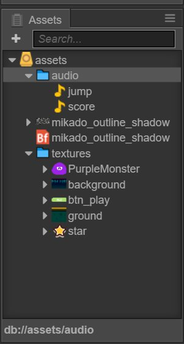
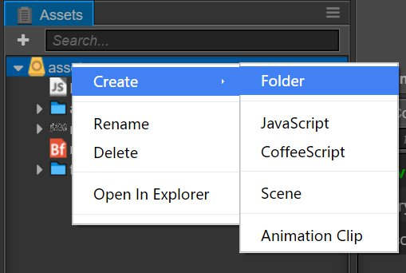
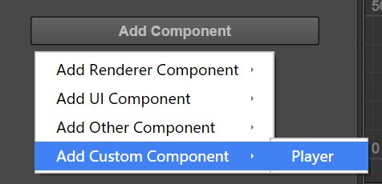
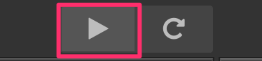
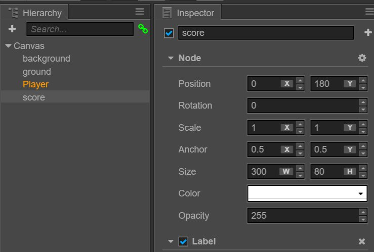
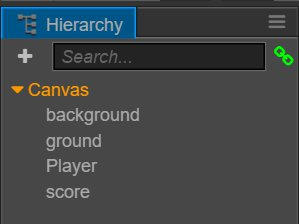
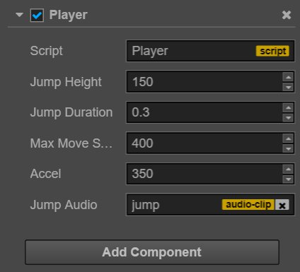

# 퀵스타트 : 당신의 첫번째 게임을 만들어보세요

지금 읽고 계시는 문서는 코코스 크리에이터의 에디터 패널, 기능 및 작업흐름에 대한 체계적인 소개가 포함되어 있습니다. 그러나 코코스 크리에이터를 통한 일반적인 게임 개발 흐름과 방법을 빨리 배우고 싶으시다면 이번 챕터가 필요합니다. 이 챕터의 튜토리얼을 마치신 후에는 게임을 만들기에 충분한 정보를 얻으실 수 있습니다. 그러나 각 기능 블럭과 완전한 작업흐름의 세부사항에 대해 이해하고 싶으시다면 가이드를 계속 읽으시는 것이 좋습니다.

이제 시작해보겠습니다! 튜토리얼을 따라 ** Pick up the Stars **라는 게임을 만듭니다. 이 게임에서 플레이어는 끊임없이 나타나는 별을 얻기 위해 멈추지 않는 ** 둔한 ** 몬스터를 조작합니다. 계속되는 가속은 플레이어에게 큰 도전을 가져올 것이며 친구들과 누가 가장 많은 별을 얻을 수 있는지 겨뤄볼 수 있습니다!

아래의 링크에서 게임의 완성본을 플레이해보세요 :

http://fbdemos.leanapp.cn/star-catcher/

## 프로젝트와 리소스 준비하기

미리 게임을 만들기 위한 모든 리소스를 준비해두었습니다. **원본 프로젝트**를 다운로드하셔서 원하는 곳에 압축을 푸시면 준비가 끝납니다:

[원본 프로젝트 다운로드](https://github.com/cocos-creator/tutorial-first-game/releases/download/v1.2/start_project.zip)

또한 이미 완성된 프로젝트를 다운로드하실 수도 있습니다. 튜토리얼을 따라 게임을 만드시다가 햇갈리는 부분이 생기시면 완성된 프로젝트를 참조해보세요.

[완성 프로젝트 다운로드](https://github.com/cocos-creator/tutorial-first-game/releases/download/v1.2/complete_project.zip)


## 원본 프로젝트 열기

코코스 크리에이터를 아직 설치하지 않으셨다면 [설치](install.md) 섹션을 참조하세요.

1. 먼저, 코코스 크리에이터를 시작하시고 **Open other projects**를 선택하세요
2. 폴더를 선택하기 위한 팝업 입력창에서 다운로드 및 압축 해제된 `start_project`를 선택하시고 **Open** 버튼을 클릭하세요
3. 코코스 크리에이터 에디터의 메인창이 열리면 프로젝트 상태가 다음과 같이 표시됩니다


## 게임 리소스 확인

원본 프로젝트에는 필요한 모든 게임 리소스가 포함되어 있습니다. 따라서 다른 리소스를 가져올 필요가 없습니다. 리소스 가져오기에 대한 자세한 내용은 [에셋 작업흐름] (../ asset-workflow / index.md)에서 관련된 내용을 참조하십시오.

다음으로 프로젝트의 리소스를 알아보겠습니다. 프로젝트에 할당된 모든 리소스가 표시되는 **Assets** 패널을 살펴보세요.

프로젝트 리소스의 루트 디렉토리는 **assets**입니다. **assets**은 압축 해제한 원본 프로젝트의 `assets` 디렉토리와 일치합니다. 이 디렉토리에 있는 리소스만을 코코스 크리에이터에서 프로젝트로 가져와 사용할 수 있습니다.

**Assets** 패널은 모든 디렉토리의 계층 구조를 표시할 수 있습니다.  아이콘은 폴더를 나타냅니다. 폴더의 왼쪽에 붙은 삼각형 아이콘을 클릭하면 폴더의 내용을 펼쳐서 확인하실 수 있습니다. 폴더를 완전히 펼치시면 **Assets** 패널이 아래와 같이 표시됩니다.



모든 리소스는 프로젝트로 가져온 후 확장자의 차이로 다른 유형의 리소스로 인식되며 아이콘도 달라집니다. 다음으로 프로젝트의 리소스 종류와 용도에 대해 살펴보겠습니다.

-  오디오 리소스, 일반적으로 MP3 파일입니다. `jump`와 `score`라는 오디오 파일은 각각 캐릭터가 점프하거나 점수를 얻을 때 재생됩니다.
-  비트맵 글꼴은 FNT 파일과 PNG 파일로 이루어집니다. 비트맵 글꼴는 게임 개발에서 일반적으로 사용되는 글꼴 리소스입니다. 자세한 내용은 [글꼴(Font)](../asset-workflow/font.md)을 참조해주세요
- 다양한 종류의 축약된 아이콘이 있으며, 모두 이미지 리소스로서 일반적으로는 PNG 또는 JPG 파일입니다. 프로젝트로 가져오신 후에 이미지 파일은 **texture** 종류의 리소스로 처리됩니다. 그런 다음 이러한 리소스를 씬이나 컴포넌트의 속성으로 드래그하여 사용할 수 있습니다.


## 게임 씬 만들기

코코스 크리에이터에서 게임 씬은 게임을 개발할 때 게임의 내용을 구성하는 핵심이며, 또한 플레이어에게 제공되는 모든 게임 컨텐츠를 담는 매개체입니다. 게임 씬은 일반적으로 다음의 내용들을 포함합니다:

- 씬 이미지와 단어들 (스프라이트(Sprite), 라벨(Label))
- 캐릭터
- 컴포넌트 형태로 씬 노드에 연결된 게임 로직 스크립트

플레이어가 게임을 실행하면 게임 씬이 로드됩니다. 이후에 컴포넌트를 포함한 게임 스크립트가 자동으로 실행되어 개발자가 설정한 다양한 로직이 실행됩니다. 따라서 리소스와는 별개로 게임 씬은 모든 컨텐츠 제작의 기초가 됩니다. 그러면 새로운 씬을 만들어보겠습니다.

1. **Assets** 패널에서 **assets** 디렉토리를 클릭하여 씬이 디렉토리 아래에 생성되도록 합니다
2. **Assets** 패널 왼쪽 상단에 있는 더하기 기호를 클릭하고 팝업 메뉴에서 **Scene**을 선택하세요

3. `New Scene`이라는 이름을 가진 새로운 씬을 만들었습니다. 우클릭하여 **Rename**를 선택하셔서 `game`으로 이름을 바꿔보세요.
4. `game`을 더블클릭하시면 해당 씬이 **scene editor**와 **Node Tree**에서 열립니다.

### 캔버스 이해하기

씬을 여신 후 현재 씬의 모든 노드(및 계층 관계)가 **Node Tree**에 표시됩니다. 새롭게 생성된 씬에는 `Canvas` 노드 하나만을 가집니다. **Canvas**는 캔버스 노드 또는 렌더링 루트 노드라고 부를 수 있습니다. **Canvas**를 클릭하시면 해당 속성이 **Properties** 패널에 표시됩니다.


`Design Resolution` 속성은 게임의 디자인 해상도를 규정합니다. `Fit Height`와 `Fit Width`는 서로 다른 크기의 화면에서 실행될 때 **Canvas**를 다른 해상도로 조정하는 방법을 명시합니다.

다른 해상도로 조정하는 기능이 제공되므로 일반적으로 **Canvas** 아래의 씬에 이미지를 표시하는 모든 노드들이 배치됩니다. 이런 식으로 **Canvas**의 `scale` 속성이 변경되면 하위 노드인 모든 이미지가 함께 확대되어 서로 다른 화면의 크기에 맞게 조정됩니다.

자세한 내용은 [캔버스](../components/canvas.md)를 참조하십시오. 현재로서는 추가한 씬이 **Canvas** 노드 아래 위치한다는 것을 알아야 합니다.


## 씬 이미지 설정하기

### 배경화면 추가

먼저 **Assets** 패널의 `assets/textures/background`의 경로에 따라 배경화면 이미지 리소스를 찾습니다. 그리고 해당 리소스를 클릭하여 **Arrangement editor**의 **Canvas** 노드로 드래그하십시오. **Canvas** 노드가 주황색으로 강조 표시될 때까지 마우스를 놓지 마세요. 이미지 리소스로서 `background`라는 서브 노드로서 추가됩니다.


이제 마우스 버튼을 놓으시면 **Canvas** 아래에 `background` 노드가 추가되는 것을 볼 수 있습니다. 노드를 추가하기 위해 리소스를 드래그하는 방법을 사용할 때 노드의 이름은 자동으로 이미지 리소소의 이름으로 명명됩니다.

씬을 편집하고 수정하실 때 메인 메뉴의 `document->save scene`을 사용하여 수정 사항을 즉시 저장할 수 있습니다. 또는 단축키로 저장하실 수도 있습니다: <kbd>Ctrl+S</kbd>（Windows）또는 <kbd>Cmd + S</kbd>（Mac）.

### 배경화면 크기 조정


**scene editor**에서 새롭게 추가된 배경 이미지를 볼 수 있습니다. 다음으로 전체 화면을 덮을 수 있도록 배경 이미지의 크기를 조정합니다.

먼저 `background` 노드를 클릭하여 메인 창의 좌측 상단 모서리에 있는 네번째 **rectangle tool**을 클릭하십시오:


이 도구를 사용하여 이미지 노드의 크기를 편리하게 수정할 수 있습니다.**scene editor**에서 `background`의 왼쪽에 마우스를 놓고 클릭하고 `background`의 왼쪽이 디자인 해상도를 나타내는 파란색 프레임을 초과할 때까지 왼쪽으로 드래그합니다. 그런 다음 같은 방법을 사용하여 `background`의 오른쪽을 드래그합니다.


그런 다음 배경 이미지의 크기가 디자인 해상도의 프레임을 완전히 포함하도록 위와 아래쪽 크기도 조정합니다.


**rectangle tool**을 사용하여 배경 이미지의 크기를 수정하면, **Properties** 패널의 **Node**의 `Size` 속성이 그에 따라 변경되는 것을 보실 수 있습니다. 완료 후 배경 이미지의 크기는 대략 `(1360, 760)`입니다. `Size` 속성의 입력창에 숫자 값을 직접 입력하실 수도 있습니다. 그러면 **rectangle tool**과 동일한 효과를 얻으실 수 있습니다. 이 크기의 배경 이미지는 시장에 나와있는 모든 휴대폰의 전체 화면을 커버할 수 있습니다.

### 땅 추가

우리의 주인공 캐릭터가 점프를 하기 위해서는 땅이 필요합니다. 바로 추가해봅시다. 배경 이미지와 같은 방법으로 **Assets** 패널의 `assets/textures/ground` 리소스를 **Node Tree**의 `Canvas`로 드래그합니다. 드래고 하실 때 새로 추가되는 노드와 `background` 노드의 순서 관계를 지정하실 수 있습니다. 리소스를 드래그한 상태에서 마우스 포인터를 `background` 아래쪽으로 움직이시면 `Canvas`에 주황색 프레임이 나타나고 삽입 위치를 나타내는 녹색선이 `background` 아래에 나타난 후에 마우스를 놓습니다. 이런 방식으로 `ground`가 `Canvas`의 하위 노드인 씬 계층 구조의 `background` 밑에 놓이게 됩니다.

**Node Tree**에서 아래 표시된 노드의 렌더링 순서가 위에 표시된 노드보다 우선합니다. `ground` 오브젝트가 **scene editor**에서 우선적으로 보이는 것을 확인하실 수 있습니다. 보이는 순서를 조정하기 위해서 언제든지 노드 관계를 변경하실 수 있습니다.

**rectangle tool**을 사용하여 땅 노드에 적합한 크기를 지정하실 수 있습니다. **rectangle tool**을 활성화하실 때 노드의 네 개의 면 이외의 부분을 드래그하여 노드의 위치를 수정하실 수 있습니다. 설정된 노드의 상태는 다음과 같습니다:


**rectangle tool** 외에도 **move tool** 을 사용하여 노드의 위치를 바꾸실 수 있습니다. 노드에 표시된 **move tool**의 화살표를 누르신 채로 드래그하시면 한 번에 하나의 좌표축에서 노드의 위치를 변경하실 수 있습니다.

배경과 땅의 위치를 설정하실 때 정확한 숫자값이 필요하지 않으며 추측하여 드래그하시면 됩니다. 정확한 숫자 입력을 원하시는 경우 `position`와 `size` 값을 스크린샷에 따라 직접 입력하세요.

### 주인공 추가하기

다음으로 우리의 주인공인 작은 몬스터가 등장합니다. **Assets** 패널의 assets/texture/PurpleMonster`를 **Node Tree**의 `Canvas`의 `ground` 아래로 드래그합니다. 이렇게 하면 주인공이 바로 화면에 표시됩니다.

씬 노드에서 주인공을 강조하시려면 새로 추가된 `PurpleMonster` 노드를 우클릭하셔서 이름을 `Player`로 바꿉니다.

다음으로 주인공의 속성을 설정합니다. 먼저 **Anchor**의 위치를 변경합니다. 모든 노드의 앵커 포인트는 기본적으로 노드의 정중앙입니다. 지상에서 점프하는 효과를 제대로 구현하기 위해서는 주인공의 앵커 포인트를 발 밑으로 설정해야 합니다. **Properties** 패널의 **Anchor** 속성을 찾아 `y` 값을 `0`으로 설정합니다. **scene editor**에서 주인공의 위치를 나타내는 **move tool**의 화살표가 주인공 밑으로 나타나는 것을 확인하실 수 있습니다.

**scene editor**의 `Player`를 드래그하여 땅 위에 놓으면 아래와 같은 결과를 확인하실 수 있습니다:


이런 식으로 우리의 씬의 기본적인 내용을 작성하였습니다. 다음 섹션에서는 게임의 내용을 구현하기 위한 코드를 작성해보겠습니다.


## 주인공 스크립트 작성

코코스 크리에이터 게임 개발의 핵심 아이디어 중 하나는 컨텐츠 제작과 기능 개발을 동시에 원활하게 진행하는 것입니다. 또한 예술적 컨텐츠에 중점을 두었습니다. 다음으로 함수의 흐름을 개발하는 스크립트를 작성하고 완성한 스크립트를 컨텐츠 작성자가 쉽게 사용할 수 있다는 사실을 알 수 있습니다.

심지어 이전에 한번도 프로그래밍을 해보신 적이 없어도 걱정하실 필요가 없습니다. 튜토리얼에서 필요한 모든 코드들을 제공할 것입니다. 올바른 위치에 복사하여 붙여넣기만 하시면 됩니다. 그래도 어려우시면 프로그래밍 파트너에게 도움을 요청할 수 있습니다. 그러면 주인공이 움직이는 스크립트를 작성해봅시다.

### 스크립트 작성

1. 먼저 **Assets** 패널의 `assets` 폴더에서 우클릭하셔서 `Create->folder`를 선택해주세요. 
2. `New Folder`를 우클릭하셔서 `Rename`을 선택하셔서 `scripts`로 이름을 바꿔주세요. 이제 이 곳에 우리의 모든 스크립트를 저장할 것입니다.
3. `scripts` 폴더를 우클릭하시고 `Create->JavaScript`를 선택하셔서 자바스크립트 스크립트를 생성합니다.
4. 새로 생성된 스크립트의 이름을 `Player`로 바꾸시고 해당 스크립트를 더블 클릭하시면 코드 에디터에서 해당 스크립트가 열립니다.

### 컴포넌트 속성 작성

이렇게 열린 스크립트에서는 미리 설정된 코드 블럭들이 있습니다. 이 코드들은 컴포넌트 스크립트를 작성하는데 필요한 구조입니다. 이러한 구조의 스크립트는 코코스 크리에이터의 컴포넌트로서 씬의 노드에 연결되어 노드를 조작할 수 있는 다양한 기능을 제공합니다. 먼저 몇 가지 속성을 설정하고 씬에서 조정하는 방법을 살펴보겠습니다.

**code editor**의 `Player` 스크립트의 `properties` 부분을 찾아서 아래처럼 수정하시고 <kbd>Ctrl + S</kbd>（Windows）나 <kbd>Cmd + S</kbd>（Mac）를 눌러서 저장하세요.

```js
// Player.js
    //...
    properties: {
        // 주인공의 점프 높이
        jumpHeight: 0,
        // 주인공의 점프 지속시간
        jumpDuration: 0,
        // 최고 이동 속도
        maxMoveSpeed: 0,
        // 가속도
        accel: 0,
    },
    //...
```

새로 추가된 속성은 주인공의 움직임을 규정합니다. 나중에 **Properties** 패널에서 숫자 값을 따로 설정할 수 있기 떄문에 지금은 코드에서의 숫자값을 신경 쓸 필요가 없습니다.

이제 주인공 노드에 `Player` 컴포넌트를 추가 할 수 있습니다. **Node Tree**에서 `Player` 노드를 선택하고 ** Properties ** 패널에서 ** add component ** 버튼을 클릭하여 `add user's script component->Player`를 선택하여 `Player` 컴포넌트를 주인공 노드로 추가하십시오.



이제 `Player` 노드의 **Properties** 패널에 새로 추가된 `Player` 컴포넌트를 볼 수 있습니다. 아래 이미지에 따라 주인공의 점프 및 이동과 관련된 속성을 설정합니다:


jumpDuration의 단위는 초단위입니다. 다른 값의 단위는 픽셀입니다. `Player` 컴포넌트의 현재 설정은 다음과 같습니다: 주인공의 높이는 200 픽셀입니다. 가장 높은 지점으로 점프하는데 필요한 시간은 0.3초입니다. 최대 수평 이동 속도는 초당 400 픽셀입니다. 수평 가속도는 초당 350 픽셀입니다.

이러한 모든 수치는 제안사항입니다. 나중에 게임을 실행할 때 환경설정에 따라서 **Properties** 패널의 숫자값을 수정할 수 있습니다. 코드를 따로 변경할 필요가 없습니다. 얼마나 편리합니까?

### 점프와 이동을 위한 코드 작성

다음으로 주인공의 점프에 대해 만들어보겠습니다. `properties: {...},` 코드 블럭 아래에 `setJumpAction` 메소드를 다음과 같이 붙여 넣으십시오:

```js
// Player.js
    properties: {
        //...
    },

    setJumpAction: function () {
        // 점프 뛸 때
        var jumpUp = cc.moveBy(this.jumpDuration, cc.p(0, this.jumpHeight)).easing(cc.easeCubicActionOut());
        // 점프에서 내려올 때
        var jumpDown = cc.moveBy(this.jumpDuration, cc.p(0, -this.jumpHeight)).easing(cc.easeCubicActionIn());
        // 반복
        return cc.repeatForever(cc.sequence(jumpUp, jumpDown));
    },
```

여기에서 Cocos2d-js 엔진의 일부 액션은 주인공의 점프 애니메이션을 실현하는데 사용됩니다. 자세한 내용은 [Cocos2d-js API] (http://www.cocos2d-x.org/reference/html5-js/V3.8/index.html)를 확인하십시오.

Next invoke the newly added `setJumpAction` method in the `onLoad` method and implement `runAction` to start action:
다음으로 `onLoad` 메소드에서 새로 추가된 `setJumpAction` 메소드를 호출하고 `runAction`을 통하여 액션을 시작합니다 :


```js
// Player.js
    onLoad: function () {
        // 점프 액션 초기화
        this.jumpAction = this.setJumpAction();
        this.node.runAction(this.jumpAction);
    },
```

`onLoad` 메소드는 장면을 로딩한 후 즉시 실행될 것입니다. 그래서 이후에 게임 초기화와 관련된 코드들을 넣을 것입니다.

스크립트를 저장하시면 처음으로 게임을 실행해보실 수 있습니다!

코코스 크리에이터 에디터 상단의 **preview** 버튼을 클릭하십시오. 이 버튼은 "play" 버튼처럼 보입니다. 코코스 크리에이터가 자동으로 기본 브라우저를 열고 게임을 실행합니다. 이제 우리는 주인공을 보아야 합니다 --- 보라색 괴물(주인공)이 지속적으로 활발하게 점프하는 모습을 보실 수 있습니다.



### 이동 제어

A main character that can only jump foolishly up and down on the same spot is not very promising. Let us add keyboard input for the main character, using <kbd>A</kbd> and <kbd>D</kbd> to manipulate its jump direction. Below the `setJumpAction` method, add a new `setInputControl` method:
같은 지점에서 계속 점프만 뛰는 주인공에게 다른 움직임을 추가해봅시다. <kbd>A</ kbd>와 <kbd>D</ kbd> 키를 사용하여 주인공의 점프 방향을 조작하는 키보드 입력을 추가합시다. `setJumpAction` 메소드 아래에 새로운`setInputControl` 메소드를 추가하십시오 :

```js
// Player.js
    setJumpAction: function () {
        //...
    },

    setInputControl: function () {
        var self = this;
        // 키보드 이벤트 리스너 추가
        cc.eventManager.addListener({
            event: cc.EventListener.KEYBOARD,
            // 키보드가 눌렸을 때 지정된 방향의 키가 맞는지 확인하고 해당 방향의 가속도를 설정합니다
            onKeyPressed: function(keyCode, event) {
                switch(keyCode) {
                    case cc.KEY.a:
                        self.accLeft = true;
                        self.accRight = false;
                        break;
                    case cc.KEY.d:
                        self.accLeft = false;
                        self.accRight = true;
                        break;
                }
            },
            // 키보드에서 손을 놓았을 때 해당 방향에 대한 가속도 부여를 중단합니다
            onKeyReleased: function(keyCode, event) {
                switch(keyCode) {
                    case cc.KEY.a:
                        self.accLeft = false;
                        break;
                    case cc.KEY.d:
                        self.accRight = false;
                        break;
                }
            }
        }, self.node);
    },
```

그런 다음 `onLoad` 메소드를 수정합니다. 이 메소드에서는 주인공의 왼쪽/오른쪽 가속여부를 체크하는 스위치를 추가합니다. 그런 다음 새로 추가된 `setInputControl` 메소드를 호출합니다. 씬이 로드되고 키보드 입력에 대한 모니터링을 시작합니다:

```js
// Player.js
    onLoad: function () {
        // 점프 액션 초기화
        this.jumpAction = this.setJumpAction();
        this.node.runAction(this.jumpAction);

        // 가속도 방향에 대한 스위치
        this.accLeft = false;
        this.accRight = false;
        // 주인공의 현재 수평 이동 속도
        this.xSpeed = 0;

        // 키보드 입력 리스너 초기화
        this.setInputControl();
    },
```

마지막으로 `update` 메소드에 주인공의 가속, 속도 및 현재 위치에 대한 설정을 추가하십시오.

```js
// Player.js
    update: function (dt) {
        // 현재 가속 방향에 대한 속도 업데이트
        if (this.accLeft) {
            this.xSpeed -= this.accel * dt;
        } else if (this.accRight) {
            this.xSpeed += this.accel * dt;
        }
        // 주인공의 이동속도를 최대 속도 이하로 제한
        if ( Math.abs(this.xSpeed) > this.maxMoveSpeed ) {
            // 속도가 한계에 달하면 현재 속도를 최대 속도로 지정
            this.xSpeed = this.maxMoveSpeed * this.xSpeed / Math.abs(this.xSpeed);
        }

        // 현재 속도에 따라서 주인공의 위치를 업데이트합
        this.node.x += this.xSpeed * dt;
    },
```

`update`는 씬을 불러온 후에 각 프레임마다 한번씩 호출됩니다. 일반적으로 여기에는 빈번하게 계산되거나 적시에 업데이트 되어야하는 로직을 넣습니다. 우리 게임에서 키보드 입력으로 가속 방향을 얻은 후에, 각 프레임에 대해 `update '에서 주인공의 속도와 위치를 계산합니다.

스크립트를 저장한 후에 **preview**를 클릭하여 최신 결과를 확인할 수 있습니다. 브라우저에서 미리보기를 연 후 마우스로 게임 씬을 클릭하십시오 (브라우저의 제한 때문에 키보드 입력은 게임 씬을 클릭 하신 후에만 허용될 수 있습니다). <kbd>A</ kbd> 또는 <kbd>D</ kbd> 키를 누르면 주인공을 조작하여 좌/우로 움직입니다!

이동속도가 너무 느린가요? 주인공이 너무 낮게 점프하나요? 점프하는 시간을 늘리고 싶으신가요? 문제 없습니다! `Player` 컴포넌트에 대해 다른 속성 값을 설정하면 됩니다. 아래는 참조용 설정입니다:

```
점프 높이: 150
점프 시간: 0.3
최고 이동 속도: 400
가속도: 1000
```

이렇게 속성을 설정하시면 주인공이 빨라집니다. 어떤 값을 선택하실지는 원하시는 게임의 스타일에 따라 달라집니다.

## 별 만들기

주인공은 이제 자유롭게 점프할 수 있으므로 이를 기반으로 플레이어의 목표를 만들어야합니다. 별들은 계속해서 씬에 나타나며 플레이어는 별을 터치하여 점수를 얻기 위해 주인공을 조작해야합니다. 주인공이 터치한 별은 사라지고 임의의 위치에 다시 별이 생성됩니다.

### 프리팹 만들기

반복적으로 생성해야하는 노드들은 **Prefab** 리소스로 저장할 수 있습니다. 이 리소스는 노드의 동적 생성을 위한 템플릿이 될 수 있습니다. **Prefab**에 대한 자세한 내용은 [Prefab] (../ asset-workflow / prefab.md)을 참조하십시오.

먼저 **Assets** 패널의 `assets/textures/star` 리소스를 씬으로 드래그하십시오. **Node Tree**의 아무 곳이나 괜찮습니다. 프리팹을 만들기 위한 플랫폼으로서만 씬을 필요로 하고 생성 후에는 해당 노드를 삭제할 것이기 때문입니다.

별의 위치나 랜더링 속성을 수정하실 필요는 없습니다. 그러나 별이 주인공과 접촉한 후에 사라지게하기 위해서는 특별한 컴포넌트를 추가해야 합니다. `Player` 스크립트를 추가한 것과 같은 방식으로 `Star`라는 이름을 가진 자바스크립트 스크립트를 별의 위치나 랜더링 속성을 수정하실 필요는 없습니다. 그러나 별이 주인공과 접촉한 후에 사라지게하기 위해서는 특별한 컴포넌트를 추가해야 합니다. `Player` 스크립트를 추가한 것과 같은 방식으로 `Star`라는 이름을 가진 자바스크립트 스크립트를 `assets/scripts/`에 추가합니다(`star`의 **Properties** 패널에서 **Add component**를 선택하시고 **Add custom component**를 선택하신 후에 **`Star`**를 선택하세요)


그런 다음 스크립트를 두 번 클릭하여 편집을 시작하십시오. 주인공이 별 컴포넌트를 수집할 수 있는 거리를 규정하는 속성을 추가합니다. `properties`을 수정하고 다음 내용을 추가하십시오 :

```js
// Star.js
    properties: {
        // 별과 주인공 사이의 거리가 해당 속성보다 작으면 별이 수집됩니다
        pickRadius: 0
    },
```

스크립트를 저장한 후 새로 생성된 `star` 노드에 이 스크립트를 추가하십시오. 그런 다음 **Properties** 패널에서 `Pick Radius`의 속성 값을 `60`으로 설정하십시오 :


이제 Star Prefab에 필요한 설정이 완료되었습니다. 이제 **Node Tree**에서 `star` 노드를 드래그하여 **Assets** 패널의 `assets` 폴더에 놓습니다. 다음과 같이`star`라는 Prefab 리소스를 생성해야합니다.


이제 `star` 노드를 씬에서 삭제합니다. 그리고 스크립트에서 Star의 Prefab 리소스를 사용하여 동적으로 별을 생성 할 수 있습니다.

### 게임 조작 스크립트 추가

별의 생성은 게임의 주요 로직의 일부입니다. 그러므로 `Game`이라는 이름의 스크립트를 추가하여 게임의 주요 로직 스크립트로 만들어야합니다. 채점, 실패 및 재시작에 관한 로직이 나중에 이 스크립트에 추가됩니다.

`assets/scripts` 폴더 안에 새로운 `Game` 스크립트를 추가하시고 더블 클릭하여 스크립트를 엽니다. 먼저 별을 생성하는데 필요한 속성을 추가합니다:

```js
// Game.js
    properties: {
        // 이 속성은 별의 PreFab 리소스를 인용합니다
        starPrefab: {
            default: null,
            type: cc.Prefab
        },
        // 별이 사라지는 시간의 임의의 크기
        maxStarDuration: 0,
        minStarDuration: 0,
        // 생성된 별의 위치에 대한 높이를 결정하기 위한 땅 노드
        ground: {
            default: null,
            type: cc.Node
        },
        // 주인공의 점프 높이를 획득하고 주인공의 이동 스위치를 제어하는 플레이어 노드
        player: {
            default: null,
            type: cc.Node
        }
    },
```

스크립트를 저장 한 후, **Node Tree**의 `Canvas` 노드에 `Game` 컴포넌트를 추가하십시오(`Canvas` 노드를 선택한 후 스크립트를 **Properties** 패널로 드래그하거나 **Properties** 패널의 **Add componen** 버튼을 클릭하고 `Add Custom Component`에서 `Game`을 선택하십시오.

그런 다음 **Assets** 패널의 `star` Prefab 리소스를 새로 생성된 `Game` 컴포넌트의 `Star Prefab` 속성으로 드래그하십시오. 이 속성에 대한 견적을 설정한 것은 이번이 처음입니다. 속성을 선언할 때 `type`을 참고 유형으로 설정할 때만(여기에 쓰여진 `cc.Prefab` 타입과 같이) 에셋이나 노드를 속성으로 드래그 할 수 있습니다.

그런 다음 **Node Tree**의 'ground' 및 'Player' 노드를 컴포넌트의 동일한 이름을 가진 속성으로 드래그하여 노드 인용을 완료합니다.

마지막으로 'Min Star Duration'과 'Max Star Duration'속성의 값을 '3'과 '5'로 설정하십시오. 나중에 별을 생성할 때 각 별의 지속 시간은 두 값 사이에서 무작위 값으로 선택됩니다.

### 랜덤한 위치에 별 만들기

다음으로, 우리는 별을 생성하는 로직을 추가하고 `Game`의 `onLoad` 메소드 다음에 계속 내용을 추가할 것입니다:

```js
// Game.js
    onLoad: function () {
        // obtain the anchor point of ground level on the y axis
        this.groundY = this.ground.y + this.ground.height/2;   // this.ground.top may also work
        // generate a new star
        this.spawnNewStar();
    },

    spawnNewStar: function() {
        // 미리 설정된 템플릿으로 씬에 새로운 노드 생성
        var newStar = cc.instantiate(this.starPrefab);
        // 캔버스 노드에 새로 추가된 노드 추가
        this.node.addChild(newStar);
        // 별을 무작위 위치에 배치
        newStar.setPosition(this.getNewStarPosition());
    },

    getNewStarPosition: function () {
        var randX = 0;
        // 지면의 위치와 주인공의 점프 높이에 따라 별의 y축 위치를 무작위로 획득
        var randY = this.groundY + cc.random0To1() * this.player.getComponent('Player').jumpHeight + 50;
        // 화면에 너비에 따라 별의 x축 위치를 무작위로 획득
        var maxX = this.node.width/2;
        randX = cc.randomMinus1To1() * maxX;
        // 별의 위치값을 반환
        return cc.p(randX, randY);
    }
```

스크립트를 저장한 후에 **preview** 버튼을 클릭합니다. 그러면 브라우저에서 게임이 시작된 후 별이 동적으로 생성되는 것을 볼 수 있습니다! 동일한 방법으로 게임에서 Prefab 템플릿을 사용하여 사전 설정된 노드를 동적으로 생성할 수 있습니다.


### 주인공이 별을 수집하는 동작 추가

이제 우리는 주인공이 별을 모으는 행동 로직을 추가할 것입니다. 여기서 핵심은 주인공 노드와 별 노드 사이의 거리가 수집 거리보다 짧은지 여부를 판단하기 위해 별이 언제든지 주인공 노드의 위치를 얻어야한다는 사실에 있습니다. 주인공 노드의 정보는 어떻게 얻을 수 있습니까? 전에 작업한 두 가지를 잊지 마십시오.

1. `Game` 컴포넌트에 `player`라는 속성이 있습니다. 이 속성은 주인공 노드를 인용할 수 있도록 저장합니다.
2. 각 별은 `Game`에서 동적으로 생성됩니다.

따라서 `Game` 컴포넌트의 참조를 별에 넣고 `Star` 노드의 참조를 `Game` 스크립트에서 생성된 후에 저장하면 됩니다. 그러면 언제든지 주인공 노드를 game.player로 접근할 수 있습니다. `Game` 스크립트를 열고 `spawnNewStar` 메소드의 끝에 다음 코드를 추가하십시오 :

```js
// Game.js
    spawnNewStar: function() {
        // ...
        // 게임 컴포넌트의 참조를 별 컴포넌트로 전달
        newStar.getComponent('Star').game = this;
    },
```

저장 후 `Star` 스크립트를 열면 `Game` 컴포넌트에서 인용된 `player` 노드를 사용하여 거리를 판단할 수 있습니다. `getPlayerDistance`와 `onPicked` 메소드를 추가하고 `onLoad` 메소드 아래에 넣으십시오 :

```js
// Star.js
    getPlayerDistance: function () {
        // 플레이어 노드의 위치에 따라서 거리 판단
        var playerPos = this.game.player.getPosition();
        // 두 노드 사이의 거리를 계산
        var dist = cc.pDistance(this.node.position, playerPos);
        return dist;
    },

    onPicked: function() {
        // 별을 수집하면 게임 스크립트의 별 생성 인터페이스를 호출하여 새로운 별을 생성
        this.game.spawnNewStar();
        // 그리고 현재 별 노드를 파괴
        this.node.destroy();
    },
```

그런 다음 각 프레임마다 거리를 판단하기 위한 로직을 `update` 메소드에 추가하십시오. 거리가 `pickRadius` 속성에 의해 설정된 수집 가능한 거리보다 짧으면 수집 동작을 구현하십시오 :

```js
// Star.js
    update: function (dt) {
        // 별과 주인공 사이의 거리가 수집 거리보다 짧은지 판단
        if (this.getPlayerDistance() < this.pickRadius) {
            // invoke collecting behavior
            this.onPicked();
            return;
        }
    },
```

스크립트를 저장 한 다음, 다시 미리보기하셔서 테스트해보세요. 주인공이 별에 가까워지면 별이 사라지고 임의의 위치에 새 별이 생성됩니다!

## 점수 추가하기

작은 괴물이 별을 수집하기 위해 큰 노력을 합니다. 그러나 보상을 받지 못한다면 아무런 의미가 없겠죠? 별을 수집할 때 점수를 얻는 로직을 추가해봅니다.

### 점수 라벨 추가

게임이 시작되면 점수는 0부터 시작합니다. 수집된 1개의 별마다 1점이 추가됩니다. 점수를 표시하려면 먼저 **Label** 노드를 만들어야합니다. **Node Tree**에서 `Canvas` 노드를 선택하고 마우스 오른쪽 버튼을 클릭하고 `Create -> Create Renderer Nodes -> Node With Label`을 선택하십시오. 새로운 라벨 노드가 `Canvas` 아래에 생성 될 것이고, 그것은 맨 아래에 위치할 것입니다. 다음으로 아래처럼 라벨 노드를 설정합니다.

1. 노드 이름을 `score`로 변경합니다.
2. `score` 노드를 선택하고, `position` 속성의 X, Y를 `(0, 180)`로 바꿉니다.
<!-- 0. `size` 속성의 X, Y를 `(300, 80)`으로 설정하세요. -->
3. **Label** 컴포넌트의 `String` 속성을 `Score: 0`로 바꿔주세요.
4. **Label** 컴포넌트의 `Font Size` 속성을 `50`으로 바꿔주세요.
5. **Assets** 패널에서 `assets/mikado_outline_shadow` 비트맵 폰트 리소스（아이콘이 인지 확인하세요）를 **Label** 컴포넌트의 `Font` 속성으로 드래그하십시오. 점수를 렌더링하는데 사용하는 글꼴을 변경합니다.

최종적인 모습은 아래와 같습니다(`Size`에 대해서는 걱정하지마세요):



### 게임 스크립트에 점수 로직 추가

`Game` 스크립트에서 점수를 채점하고 업데이트하는 로직을 넣을 것입니다. `Game` 스크립트를 열어 편집을 시작하세요. 먼저 스코어 디스플레이 라벨의 참조 속성을 `properties` 블록의 끝에 추가하세요.

```js
// Game.js
    properties: {
        // ...
        // 점수 라벨의 참조
        scoreDisplay: {
            default: null,
            type: cc.Label
        }
    },
```

다음으로, `onLoad` 메소드에서 점수를 위한 변수의 초기화를 추가하십시오:

```js
// Game.js
    onLoad: function () {
        // ...
        // 점수 초기화
        this.score = 0;
    },
```

그런 다음 `update` 메소드의 뒤쪽에 `gainScore`라는 새로운 메소드를 추가하십시오:

```js
// Game.js
    gainScore: function () {
        this.score += 1;
        // 스코어 디스플레이 라벨의 문자열 업데이트
        this.scoreDisplay.string = 'Score: ' + this.score.toString();
    },
```

### (score 노드를 "Canvas" 속성 패널의 "Score Display" 속성으로 드래그하는 것을 잊지 마세요).

### 별 관련 스크립트에서 점수 로직을 호출

`Game` 스크립트를 저장하신 후 `Star` 스크립트를 엽니다. `onPicked` 메소드에 `gainScore` 호출을 추가하십시오:

```js
// Star.js
    onPicked: function() {
        // 별이 수집될 때 게임 스크립트의 인터페이스를 호출하여 새로운 별을 생성합니다.
        this.game.spawnNewStar();
        // 게임 스크립트의 점수 메소드를 호출합니다.
        this.game.gainScore();
        // 현재 별 노드를 파괴합니다
        this.node.destroy();
    },
```

저장하고 미리보기를 해보시면 별을 수집할 때마다 화면 상단에 표시되는 점수가 증가하는 것을 보실 수 있습니다!


## 게임 오버 및 재시작

이제 우리 게임이 완성되었습니다. 그러나 아무리 많은 점수를 얻더라도 영원히 끝나지 않는 게임은 플레이어에게 어떠한 만족감도 주지 않습니다. 이제 별이 규칙적으로 사라지는 동작을 추가해보겠습니다. 그리고 모든 별이 사라지면 게임은 실패한 것으로 간주됩니다. 즉 플레이어는 별이 사라지기 전에 별을 수집하는 과정을 반복해야 합니다.

### 일정 시간 후에 별이 사라지는 로직 추가

`Game` 스크립트를 열고`onLoad` 메소드의 `spawnNewStar`를 호출하기 전에 시간 계산에 필요한 변수 선언을 추가하십시오 :

```js
// Game.js
    onLoad: function () {
        // ...
        // 타이머 초기화
        this.timer = 0;
        this.starDuration = 0;
        // 새로운 별 생성
        this.spawnNewStar();
        // 점수 초기화
        this.score = 0;
    },
```

그런 다음 타이머를 `spawnNewStar` 메소드 끝에 추가하는 로직을 추가하십시오.`this.minStarDuration`과 `this.maxStarDuration`는 처음에 선언된`Game` 컴포넌트의 속성입니다. 그들은 별의 지속 시간의 무작위 크기를 규정하는 데 사용됩니다 :

```js
// Game.js
    spawnNewStar: function() {
        // ...
        // 타이머 리셋, 설정값에 따라 임의로 별 지속시간 결정
        this.starDuration = this.minStarDuration + cc.random0To1() * (this.maxStarDuration - this.minStarDuration);
        this.timer = 0;
    },
```

타이머를 갱신하는 로직과 지속시간을 초과하는 판단을 `update` 메소드에 추가하십시오:

```js
// Game.js
    update: function (dt) {
        // 지속시간이 초과할 때까지 새로운 별이 생성되지 않으면
        // 게임 실패 로직 호출
        if (this.timer > this.starDuration) {
            this.gameOver();
            return;
        }
        this.timer += dt;
    },
```

마지막으로 `gameOver` 메소드를 추가하십시오. 게임 실패가 발생하면 씬을 다시 로드하십시오.

```js
// Game.js
    gameOver: function () {
        this.player.stopAllActions(); // 플레이어 노드의 점프 액션 중지
        cc.director.loadScene('game');
    }
```

이제 `Game` 스크립트의 수정이 끝났습니다. 스크립트를 저장하고 `Star` 스크립트를 여십시오. 왜냐하면 사라질 별에 간단한 시각적 효과를 추가하기 위해서입니다. `update` 메소드의 끝에 다음 코드를 추가하십시오 :

```js
// Star.js
    update: function() {
        // ...
        // 게임 스크립트의 타이머에 따로 별의 투명도 조정
        var opacityRatio = 1 - this.game.timer/this.game.starDuration;
        var minOpacity = 50;
        this.node.opacity = minOpacity + Math.floor(opacityRatio * (255 - minOpacity));
    }
```

`Star` 스크립트를 저장하면 이 게임의 플레이 로직은 완전히 끝납니다. 이제 **preview** 버튼을 클릭하면 브라우저에 핵심 게임 로직, 인센티브 및 실패 매커니즘이 있는 검증된 게임이 실행됩니다.

## 사운드 효과 추가

많은 사람들이 스마트폰 게임을 할 때 사운드를 무시하지만 자습서에 제시된 작업흐름의 완성을 위해 사운드 효과를 추가하는 작업을 해봅시다.

### 점프 사운드 효과

먼저 점프 사운드 효과를 추가합니다. `Player` 스크립트를 열고 사운드 효과 리소스를 참조하는 `jumpAudio` 속성을 추가하십시오 :

```js
// Player.js
    properties: {
        // ...
        // 점프 사운드 효과 리소스
        jumpAudio: {
            default: null,
            url: cc.AudioClip
        },
    },
```

그런 다음 `setJumpAction` 메소드를 다시 작성하여 사운드 효과를 재생하기 위한 콜백을 삽입하고,`playJumpSound` 메소드를 추가하여 사운드를 재생하십시오 :

```js
// Player.js
    setJumpAction: function () {
        // 점프 할 때
        var jumpUp = cc.moveBy(this.jumpDuration, cc.p(0, this.jumpHeight)).easing(cc.easeCubicActionOut());
        // 점프 후 내려올 때
        var jumpDown = cc.moveBy(this.jumpDuration, cc.p(0, -this.jumpHeight)).easing(cc.easeCubicActionIn());
        // 액션이 끝난 후 다른 정의된 메소드를 호출하는 콜백 함수 추가
        var callback = cc.callFunc(this.playJumpSound, this);
        // 끊임없이 반복하고 매번 착륙한 후 콜백을 호출하여 소리를 재생합니다.
        return cc.repeatForever(cc.sequence(jumpUp, jumpDown, callback));
    },

    playJumpSound: function () {
        // 사운드 엔진의 사운드 효과를 재생
        cc.audioEngine.playEffect(this.jumpAudio, false);
    },
```

### 점수 사운드 효과

`Player` 스크립트를 저장한 후 `Game` 스크립트를 열어 점수 사운드 효과를 추가하십시오. 사운드 리소스를 인용하기 위해 'properties'에 속성을 추가합니다:

```js
// Game.js
    properties: {
        // ...
        // 점수 사운드 효과 리소스
        scoreAudio: {
            default: null,
            url: cc.AudioClip
        }
    },
```

그런 다음 사운드를 재생하는 코드를 `gainScore` 메소드에 삽입하십시오:

```js
// Game.js
    gainScore: function () {
        this.score += 1;
        // 점수 라벨의 표시되는 문자열을 업데이트
        this.scoreDisplay.string = 'Score: ' + this.score.toString();
        // 점수 사운드 효과 재생
        cc.audioEngine.playEffect(this.scoreAudio, false);
    },
```

스크립트를 저장하십시오. **Node Tree**로 돌아가 `Player` 노드를 선택하고 **assets** 패널의 `assets/audio/jump` 리소스를 `Player` 컴포넌트의 `Jump Audio` 속성으로 드래그하십시오.

그런 다음 `Canvas` 노드를 선택하고 `assets/audio/score` 리소스를 `Game` 컴포넌트의 `Score Audio` 속성으로 드래그하십시오.

이제 끝입니다! 완성된 씬 계층과 각 주요 컴포넌트의 속성은 다음과 같습니다.

 

 



이제 새로 만든 게임을 완전히 즐길 수 있습니다. 얼마나 많은 점수를 얻을 수 있습니까? 게임의 난이도를 빠르게 조정하기 위해 언제든지 'Player' 및 'Game' 컴포넌트에서 동작 제어 및 별 지속 시간 등과 같은 게임 매개 변수를 수정할 수 있다는 것을 잊지 마십시오. 씬은 컴포넌트 속성을 수정 한 후에 저장해야합니다. 오직 저장한 값만 사용할 수 있습니다.

## 요약

축하합니다! 코코스 크리에이터로 당신의 첫번째 게임을 완성했습니다. 초보자를 위한 퀵스타트 튜토리얼이 코코스 크리에이터의 게임 개발 프로세스의 기본 개념과 작업흐름을 이해하는데 도움이 되기를 바랍니다. 스크립트 프로그래밍 학습에 관심이 없다면 완성 프로젝트에서 스크립트를 직접 복사하여 붙여넣으셔도 무방합니다.

다음으로 당신은 이 게임을 보다 완벽하게 만들 수 있습니다. 몇가지 권장하는 개선 방법은 다음과 같습니다.

- 간단한 시작 메뉴를 추가하고 게임이 시작될 때 시작 버튼을 표시하십시오. 버튼을 클릭 한 후에 게임이 시작됩니다.
- 게임 실패에 대한 간단한 메뉴 인터페이스를 추가하십시오. 버튼을 클릭 한 후에 게임이 다시 시작됩니다.
- 주인공이 창 너머까지 움직일 수 없도록 제한
- 주인공의 점프 동작에 보다 정교한 애니메이션 성능 추가
- 별이 사라지는 상황에서 카운트 다운 진행률 막대를 추가합니다.
- 별 수집시 더욱 멋진 효과 추가
- 터치 스크린 장치 용 입력 제어 추가

위의 모든 측면에서 개선 된 버전의 경우 [개선 버전 프로젝트] (https://github.com/cocos-creator/tutorial-first-game/releases/download/v1.2/polished_project.zip)를 다운로드할 수 있습니다. 관련해서는 여기에서 자세히 설명하지 않습니다.

또한 완성된 게임을 서버에서 공개하여 친구들과 공유하고 싶다면 [미리보기 빌드] (basics/preview-build.md) 부분을 참고하세요.

오늘의 튜토리얼은 여기서 끝납니다. 즉시 두 번째 코코스 크리에이트 게임을 만들시려면 이 가이드를 계속 읽으십시오. 이 퀵 스타트 튜토리얼에 대한 질문이 있으면 [Github 튜토리얼 창고] (https://github.com/cocos-creator/tutorial-first-game)에서 관련 의견을 제시하실 수 있습니다.

---

엔진 사용법에 대해 더 알고 싶으시다면 아래 문서를 읽어보세요:

- [Cocos2d-x 유저 가이드](cocos2d-x-guide.md)
